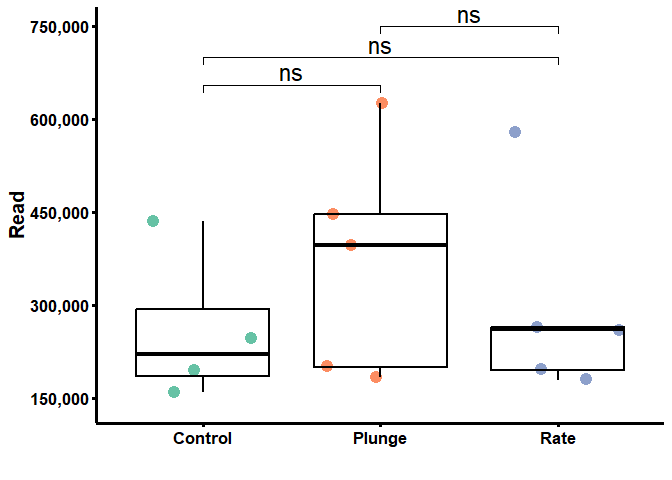
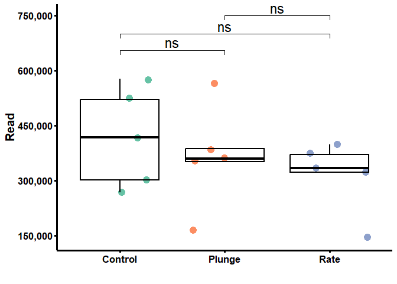
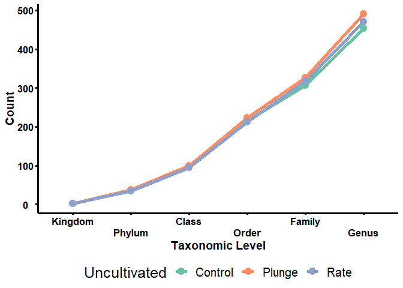
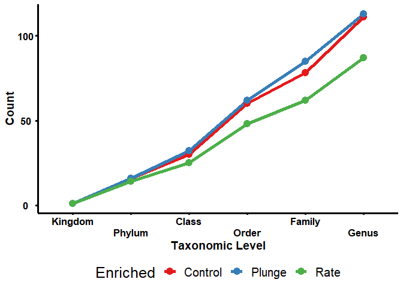
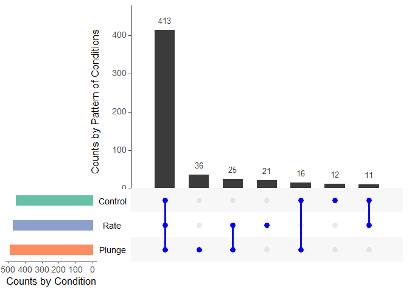
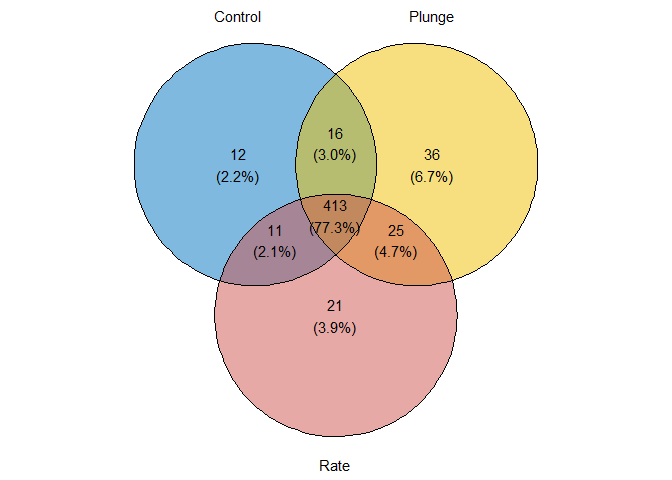
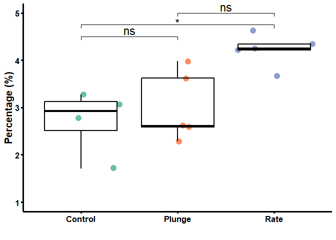
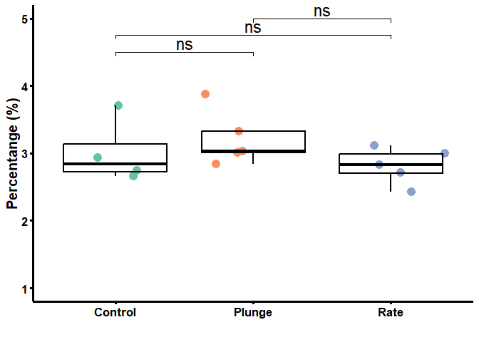
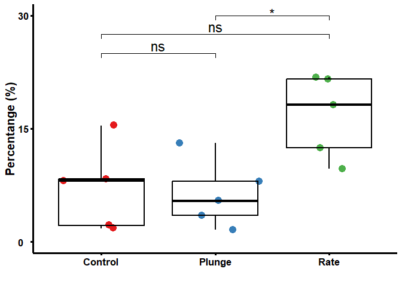
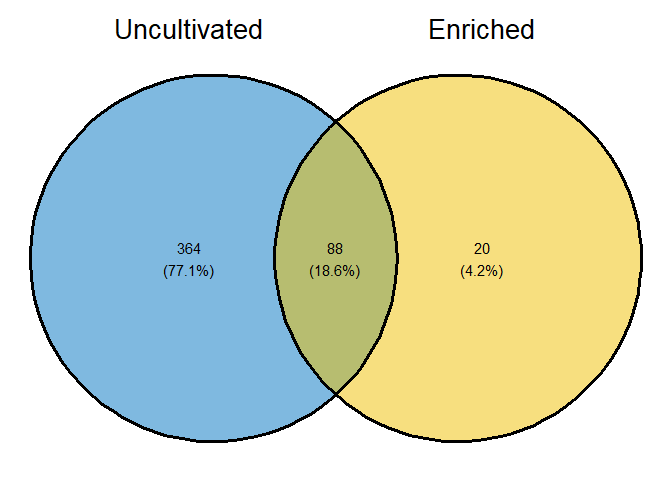

-   [Cyropreserve CABI](#cyropreserve-cabi)

## Cyropreserve CABI

Soil microbiomes are responsive to seasonal and long-term environmental
factors, impacting their composition and function. This manuscript
explores cryopreservation techniques using a controlled rate cooler and
assesses the genomic integrity and bacterial growth of an exemplar soil
sample before and after cryopreservation. The study demonstrates that
the controlled rate cooler effectively preserves the DNA content of the
microbiome. Two cryopreservation methods were compared with control
samples, and the results indicate successful cryopreservation using
metabarcoding. Enrichment with liquid medium showed similar responses
between cryopreserved and non-cryopreserved soil samples, supporting the
efficacy of cryopreservation. This study represents the first report of
cryopreservation of soil using a Stirling cycle cooling approach,
highlighting its potential for future microbiome research.

### Load the required packages

    # install.packages(c("ggplot2", "ggpubr", "dplyr", 
    #                   "rstatix", "purrr", "reshape2",
    #                   "UpSetR","plyr", "dplyr", "RColorBrewer"))
    library("ggplot2")
    library("ggpubr")
    library("dplyr")
    library("rstatix")
    library("purrr")
    library("reshape2")
    library("UpSetR")
    library("plyr")
    library("dplyr")
    library("RColorBrewer")

    # if (!require("BiocManager", quietly = TRUE))
    #     install.packages("BiocManager")
    # BiocManager::install(c("phyloseq", "DESeq2", "microbiome"))
    library("phyloseq")
    library("DESeq2")
    library("microbiome")

    # if(!requireNamespace("devtools", quietly = TRUE)){install.packages("devtools")}
    # devtools::install_github("jbisanz/qiime2R") # current version is 0.99.20
    library("qiime2R")

    # devtools::install_github("pmartinezarbizu/pairwiseAdonis/pairwiseAdonis")
    library("pairwiseAdonis")

    # if (!require(devtools)) install.packages("devtools")
    # devtools::install_github("yanlinlin82/ggvenn")
    library("ggvenn")

### Qiime2 to Phyloseq

To work with QIIME2 outcomes in the R environment, it is beneficial to
convert the data into the phyloseq object structure. This process
involves importing and transforming the feature table and sample
metadata, allowing for comprehensive analysis and visualisation of
microbial community profiles. The phyloseq package in R provides
functions to organize and manipulate the data within the phyloseq
object, enabling various analyses such as diversity assessments,
differential abundance testing, and taxonomic profile visualization. By
converting QIIME2 outcomes to phyloseq, researchers can leverage the
capabilities of R for advanced statistical analysis, integration with
other omics data, and gaining deeper insights into the microbiome
datasets.

    # Convert qiime2 to phyloseq format
    physeq <- qza_to_phyloseq(
      features = "qiime2/430_327_213_table-with-phyla-no-mitochondria-no-chloroplast.qza", # table.qza
      # tree = "inst/artifacts/2020.2_moving-pictures/rooted-tree.qza",
      taxonomy = "qiime2/430_327_213_taxonomy.qza",
      metadata = "16s-meta-data.txt"
    )

    physeq ## confirm the object

    ## phyloseq-class experiment-level object
    ## otu_table()   OTU Table:         [ 14243 taxa and 29 samples ]
    ## sample_data() Sample Data:       [ 29 samples by 5 sample variables ]
    ## tax_table()   Taxonomy Table:    [ 14243 taxa by 7 taxonomic ranks ]

### Normalise number of reads in each sample by using median sequencing depth

In the process of data normalisation, we employed a technique known as
Total Sum Scaling (TSS). This method is particularly effective in
scaling the counts in each sample to correspond with the median
sequencing depth observed across all samples. Consequently, this
approach yields normalised sequence counts.

    # Calculate the median sequencing depth
    total <- median(sample_sums(physeq)) 
    # Define a scaling function
    standf <- function(x, t = total) round(t * (x / sum(x)))
    # Normalise the sample counts using the scaling function
    physeq.norm <- transform_sample_counts(physeq, standf)

    # Clean up by removing objects that are no longer needed
    rm(total, standf)

### Sub-grouping

Separate analysis is necessary for the uncultivated and enriched
experiments since the data contained in each subset differs and requires
distinct examination.

    ## Subgroup - Uncultivated
    physeq.norm.ori <- subset_samples(physeq.norm, Comparison=="Uncultivated") 
    # Get the column names of the sample_data
    colnames(sample_data(physeq.norm.ori))

    ## [1] "Label"      "Group"      "Comparison" "Category"   "Raw_Reads"

    # Find the index of the "Group" column
    group_index <- which(colnames(sample_data(physeq.norm.ori)) == "Group")
    # Rename the "Group" column to "Uncultivated"
    colnames(sample_data(physeq.norm.ori))[group_index] <- "Uncultivated"
    # Copy the column information from "Uncultivated" to "Group"
    sample_data(physeq.norm.ori)$Group <- sample_data(physeq.norm.ori)$Uncultivated

    ## Subgroup - Enriched
    physeq.norm.rich <- subset_samples(physeq.norm, Comparison=="Enriched") 
    # Get the column names of the sample_data
    colnames(sample_data(physeq.norm.rich))

    ## [1] "Label"      "Group"      "Comparison" "Category"   "Raw_Reads"

    # Find the index of the "Group" column
    group_index <- which(colnames(sample_data(physeq.norm.rich)) == "Group")
    # Rename the "Group" column to "Uncultivated"
    colnames(sample_data(physeq.norm.rich))[group_index] <- "Enriched"
    # Copy the column information from "Enriched" to "Group"
    sample_data(physeq.norm.rich)$Group <- sample_data(physeq.norm.rich)$Enriched

    ## Merge the replicate samples for each Group
    physeq.norm.group = merge_samples(physeq.norm, "Category") # Sum between replicate samples
    sample_data(physeq.norm.group)$Category <- rownames(sample_data(physeq.norm.group))

    physeq.norm.ori.group = merge_samples(physeq.norm.ori, "Uncultivated") # Sum between replicate samples
    sample_data(physeq.norm.ori.group)$Uncultivated <- rownames(sample_data(physeq.norm.ori.group))

    physeq.norm.rich.group = merge_samples(physeq.norm.rich, "Enriched") # Sum between replicate samples
    sample_data(physeq.norm.rich.group)$Enriched <- rownames(sample_data(physeq.norm.rich.group))

    # Clean up by removing objects that are no longer needed
    rm(group_index)

### Plot the raw reads - Uncultivated Experiment

    physeq.ori <- subset_samples(physeq, Comparison=="Uncultivated") 
    # Calculate the total raw reads of for each sample
    meta <- data.frame(physeq.ori@sam_data)

    # Now you can use 'meta_df' in your functions
    stat.test1 <- meta %>%
      t_test(Raw_Reads ~ Group) %>%
      adjust_pvalue(method = "bonferroni") %>%
      add_significance()

    print(stat.test1)

    ## # A tibble: 3 × 10
    ##   .y.       group1  group2    n1    n2 statistic    df     p p.adj p.adj.signif
    ##   <chr>     <chr>   <chr>  <int> <int>     <dbl> <dbl> <dbl> <dbl> <chr>       
    ## 1 Raw_Reads Control Plunge     4     5    -1.09   6.86 0.314 0.942 ns          
    ## 2 Raw_Reads Control Rate       4     5    -0.386  7.00 0.711 1     ns          
    ## 3 Raw_Reads Plunge  Rate       5     5     0.682  7.88 0.515 1     ns

    # Plot a graph of the abundance of Fusarium for each sample grouped by Group:
    Raw_Reads.Ori <- ggplot(subset(meta, Group %in% c("Control","Plunge","Rate")),
                            aes(x = Group, y = Raw_Reads, colour = interaction(Group))) +
      geom_point(alpha = 1, position = "jitter", size = 4) +
      geom_boxplot(alpha = 0, colour = "black", size = 0.8) +
      scale_y_continuous(labels = scales::comma, limits=c(140000, 750000), 
                         breaks = c(150000, 300000, 450000, 600000, 750000)) + 
        stat_pvalue_manual(stat.test1, 
                         y.position = c(655000, 700000, 750000),
                         label = "p.adj.signif",
                         face="bold", 
                         size = 6, 
                         linetype = 1,
                         tip.length = 0.02,
                         inherit.aes = FALSE) + 
      theme_classic() + 
      labs(x = "", y = "Read") +
      theme(text = element_text(size=18, colour = "black"), 
            axis.ticks = element_line(colour = "black", size = 1.25),
            axis.line = element_line(colour = 'black', size = 1.25),
            axis.text.x = element_text(colour = "black",
                                       angle=0, 
                                       size = 13, face="bold"),
            axis.text.y = element_text(angle=0, hjust=0, colour = "black",
                                       size = 13, face="bold"),
            axis.title.y = element_text(color="black", size=15,face="bold"),
            legend.position = "none") +
      scale_color_brewer(palette="Set2")+
      scale_fill_brewer(palette="Set2")

    # pdf(file = "Raw_Reads.Ori.pdf", width = 6, height = 5)
    Raw_Reads.Ori

    # Close the PDF device and save the plot to a file
    # dev.off()

    # Clean up by removing objects that are no longer needed
    rm(physeq.ori, meta, Raw_Reads.Ori, stat.test1)

### Plot the raw reads - Enriched Experiment

    physeq.rich <- subset_samples(physeq, Comparison=="Enriched") 
    # Calculate the total raw reads of for each sample
    meta <- data.frame(physeq.rich@sam_data)

    # Now you can use 'meta_df' in your functions
    stat.test1 <- meta %>%
      t_test(Raw_Reads ~ Group) %>%
      adjust_pvalue(method = "bonferroni") %>%
      add_significance()

    print(stat.test1)

    ## # A tibble: 3 × 10
    ##   .y.       group1  group2    n1    n2 statistic    df     p p.adj p.adj.signif
    ##   <chr>     <chr>   <chr>  <int> <int>     <dbl> <dbl> <dbl> <dbl> <chr>       
    ## 1 Raw_Reads Control Plunge     5     5     0.583  7.97 0.576 1     ns          
    ## 2 Raw_Reads Control Rate       5     5     1.38   7.37 0.209 0.627 ns          
    ## 3 Raw_Reads Plunge  Rate       5     5     0.661  7.12 0.529 1     ns

    # Plot a graph of the abundance of Fusarium for each sample grouped by Group:
    Raw_Reads.rich <- ggplot(subset(meta, Group %in% c("Control","Plunge","Rate")),
           aes(x = Group, y = Raw_Reads, colour = interaction(Group))) +
      geom_point(alpha = 1, position = "jitter", size = 4) +
      geom_boxplot(alpha = 0, colour = "black", size = 0.8) +
      scale_y_continuous(labels = scales::comma, limits=c(140000, 750000), 
                         breaks = c(150000, 300000, 450000, 600000, 750000)) + 
          stat_pvalue_manual(stat.test1, 
                         y.position = c(655000, 700000, 750000),
                         label = "p.adj.signif",
                         face="bold", 
                         size = 6, 
                         linetype = 1,
                         tip.length = 0.02,
                         inherit.aes = FALSE) + 
      theme_classic() + 
      labs(x = "", y = "Read") +
      theme(text = element_text(size=18, colour = "black"), 
            axis.ticks = element_line(colour = "black", size = 1.25),
            axis.line = element_line(colour = 'black', size = 1.25),
            axis.text.x = element_text(colour = "black",
                                       angle=0, 
                                       size = 13, face="bold"),
            axis.text.y = element_text(angle=0, hjust=0, colour = "black",
                                       size = 13, face="bold"),
            axis.title.y = element_text(color="black", size=15,face="bold"),
            legend.position = "none") +
      scale_color_brewer(palette="Set2")+
      scale_fill_brewer(palette="Set2")

    # pdf(file = "Raw_Reads.rich.pdf", width = 6, height = 5)
    Raw_Reads.rich

    # Close the PDF device and save the plot to a file
    # dev.off()

    # Clean up by removing objects that are no longer needed
    rm(physeq.rich, meta, Raw_Reads.rich)

### Beta diversity

Beta diversity is a measure used in ecological and microbial community
studies to assess the dissimilarity of species or taxa compositions
between different samples. It quantifies the variation in community
structure and helps researchers understand the diversity and uniqueness
of microbial communities. Various metrics, such as Bray-Curtis
dissimilarity and Jaccard index, are employed to calculate beta
diversity values, which can be visualised using techniques like
Principal Coordinate Analysis or Non-Metric Multidimensional Scaling.
Beta diversity analysis allows for comparisons of microbial communities
across habitats, treatments, or environmental gradients, revealing
factors influencing community variation and identifying key drivers of
community structure. It provides insights into the functional and
ecological significance of different microbial assemblages and their
responses to environmental changes, aiding our understanding of
microbial community dynamics and their roles in ecology, environmental
science, and human health research.

#### Beta diversity - Uncultivated Experiment

    nmds.ori <- ordinate(physeq = physeq.norm.ori, method = "NMDS", distance = "bray")

    ## Square root transformation
    ## Wisconsin double standardization
    ## Run 0 stress 0.04166808 
    ## Run 1 stress 0.04825554 
    ## Run 2 stress 0.05088141 
    ## Run 3 stress 0.04825553 
    ## Run 4 stress 0.05741057 
    ## Run 5 stress 0.04394385 
    ## Run 6 stress 0.04882746 
    ## Run 7 stress 0.04882747 
    ## Run 8 stress 0.04857379 
    ## Run 9 stress 0.04166808 
    ## ... New best solution
    ## ... Procrustes: rmse 4.801118e-06  max resid 1.168092e-05 
    ## ... Similar to previous best
    ## Run 10 stress 0.05088153 
    ## Run 11 stress 0.04480245 
    ## Run 12 stress 0.04561031 
    ## Run 13 stress 0.04394386 
    ## Run 14 stress 0.05912189 
    ## Run 15 stress 0.04166811 
    ## ... Procrustes: rmse 2.503249e-05  max resid 4.318559e-05 
    ## ... Similar to previous best
    ## Run 16 stress 0.04825556 
    ## Run 17 stress 0.07870264 
    ## Run 18 stress 0.05088141 
    ## Run 19 stress 0.04825555 
    ## Run 20 stress 0.05798106 
    ## *** Best solution repeated 2 times

    Beta.ori <- plot_ordination(
      physeq = physeq.norm.ori,
      ordination = nmds.ori,
      color = "Uncultivated",
      shape = "Uncultivated") +
      theme_classic() + 
      geom_point(aes(color = Uncultivated), alpha = 1, size = 4) +
      theme(text = element_text(size=18, colour = "black"), 
            axis.ticks = element_line(colour = "black", size = 1.1),
            axis.line = element_line(colour = 'black', size = 1.1),
            axis.text.x = element_text(colour = "black", angle=0, 
                                       hjust=0.5, size = 13, face="bold"),
            axis.text.y = element_text(colour = "black", angle=0, 
                                       hjust=0.5, size = 13, face="bold"),
            axis.title.y = element_text(color="black", size=20,face="bold"), 
            axis.title.x = element_text(color="black", size=20,face="bold"),
            legend.position = "bottom") + # This line moves the legend to the bottom
      stat_ellipse(geom = "polygon", type="norm", 
                   alpha=0.25, aes(fill = Uncultivated)) + # polygon, path, point
      scale_color_brewer(palette="Set2")+
      scale_fill_brewer(palette="Set2")

    # pdf(file = "Beta.ori.pdf", width = 6,height = 6.1)
    Beta.ori

    # Close the PDF device and save the plot to a file
    # dev.off()

    # Clean up by removing objects that are no longer needed
    rm(nmds.ori, Beta.ori, nmds.ori)

#### Beta diversity - Enriched Experiment

    nmds.rich <- ordinate(physeq = physeq.norm.rich, method = "NMDS", distance = "bray")

    ## Square root transformation
    ## Wisconsin double standardization
    ## Run 0 stress 0.08844091 
    ## Run 1 stress 0.08835001 
    ## ... New best solution
    ## ... Procrustes: rmse 0.04285778  max resid 0.1460723 
    ## Run 2 stress 0.09117322 
    ## Run 3 stress 0.0878326 
    ## ... New best solution
    ## ... Procrustes: rmse 0.0395189  max resid 0.1055277 
    ## Run 4 stress 0.09117322 
    ## Run 5 stress 0.08799876 
    ## ... Procrustes: rmse 0.04775843  max resid 0.1433539 
    ## Run 6 stress 0.08799876 
    ## ... Procrustes: rmse 0.04775028  max resid 0.1433513 
    ## Run 7 stress 0.0879525 
    ## ... Procrustes: rmse 0.03103999  max resid 0.1037138 
    ## Run 8 stress 0.09171834 
    ## Run 9 stress 0.08799876 
    ## ... Procrustes: rmse 0.04776031  max resid 0.1433549 
    ## Run 10 stress 0.08794181 
    ## ... Procrustes: rmse 0.04816027  max resid 0.1458173 
    ## Run 11 stress 0.08794181 
    ## ... Procrustes: rmse 0.04816026  max resid 0.145846 
    ## Run 12 stress 0.08794181 
    ## ... Procrustes: rmse 0.04815913  max resid 0.1457494 
    ## Run 13 stress 0.09575903 
    ## Run 14 stress 0.09608784 
    ## Run 15 stress 0.09575834 
    ## Run 16 stress 0.09117322 
    ## Run 17 stress 0.08795253 
    ## ... Procrustes: rmse 0.03106185  max resid 0.1037784 
    ## Run 18 stress 0.08794181 
    ## ... Procrustes: rmse 0.04816214  max resid 0.1458097 
    ## Run 19 stress 0.09575888 
    ## Run 20 stress 0.08900447 
    ## *** Best solution was not repeated -- monoMDS stopping criteria:
    ##      2: no. of iterations >= maxit
    ##     18: stress ratio > sratmax

    Beta.rich <- plot_ordination(
      physeq = physeq.norm.rich,
      ordination = nmds.rich,
      color = "Enriched",
      shape = "Enriched") +
      theme_classic() +
      geom_point(aes(color = Enriched), alpha = 1, size = 4) +
      theme(text = element_text(size=18, colour = "black"), 
            axis.ticks = element_line(colour = "black", size = 1.1),
            axis.line = element_line(colour = 'black', size = 1.1),
            axis.text.x = element_text(colour = "black", angle=0, hjust=0.5, size = 13, face="bold"),
            axis.text.y = element_text(colour = "black", angle=0, hjust=0.5, size = 13, face="bold"),
            axis.title.y = element_text(color="black", size=20,face="bold"), 
            axis.title.x = element_text(color="black", size=20,face="bold"),
            legend.position = "bottom") + # This line moves the legend to the bottom
      stat_ellipse(geom = "polygon", type="norm", alpha=0.15, aes(fill=Enriched))+ 
      scale_color_brewer(palette="Set1")+
      scale_fill_brewer(palette="Set1")

    # pdf(file = "Beta.rich.pdf", width = 6,height = 6.1)
    Beta.rich

    # Close the PDF device and save the plot to a file
    # dev.off()

    # Clean up by removing objects that are no longer needed
    rm(nmds.ori, Beta.ori, nmds.rich, Beta.rich)

### Alpha diversity

Alpha diversity is a fundamental concept in ecology and refers to the
diversity or richness of species within a specific community or habitat.
In the context of microbial ecology, alpha diversity represents the
diversity of microorganisms within a given sample or microbiome. It
provides insights into the variety and evenness of microbial species
present in a particular environment. Common measures of alpha diversity
include species richness, which counts the number of unique species, and
evenness, which assesses the distribution of species abundances. Alpha
diversity is crucial for understanding the stability, resilience, and
functional potential of microbial communities. It can be influenced by
various factors, including environmental conditions, host factors, and
perturbations. By comparing alpha diversity across different samples or
experimental groups, researchers can gain insights into the impact of
factors such as disease, habitat changes, or interventions on microbial
community structure.

#### Alpha diversity - Uncultivated Experiment

    tab = cbind(x = sample_data(physeq.norm.ori), 
                y = estimate_richness(physeq.norm.ori, measures = 'Fisher'))

    stat.test <- tab %>%
      t_test(Fisher ~ x.Uncultivated) %>%
      adjust_pvalue(method = "bonferroni") %>%
      add_significance()

    print(stat.test)

    ## # A tibble: 3 × 10
    ##   .y.    group1  group2    n1    n2 statistic    df     p p.adj p.adj.signif
    ##   <chr>  <chr>   <chr>  <int> <int>     <dbl> <dbl> <dbl> <dbl> <chr>       
    ## 1 Fisher Control Plunge     4     5    -1.23   6.71 0.261 0.783 ns          
    ## 2 Fisher Control Rate       4     5    -0.467  6.98 0.655 1     ns          
    ## 3 Fisher Plunge  Rate       5     5     0.750  7.79 0.475 1     ns

    alpha.ori <- ggplot(data = tab, aes(x = x.Uncultivated, 
                                        y = Fisher, 
                                        color = x.Uncultivated, 
                                        fill = x.Uncultivated)) + 
      theme_classic() + 
      labs(
        x = element_blank(), 
        y = "Alpha Diversity (Fisher)") + 
      geom_point(size = 3) + 
      geom_boxplot(alpha = 0.7) + 
      stat_pvalue_manual(stat.test, 
                         y.position = c(1250, 1305, 1370),
                         label = "p.adj.signif",
                         face="bold", 
                         size = 6, 
                         linetype = 1,
                         tip.length = 0.02,
                         inherit.aes = FALSE) + 
      scale_y_continuous(limits=c(350, 1380), breaks = c(350, 700, 1050, 1360)) +
      theme(text = element_text(size=18, colour = "black"), 
            axis.ticks = element_line(colour = "black", size = 1.25),
            axis.line = element_line(colour = 'black', size = 1.25),
            axis.text.x = element_text(colour = "black",angle=0, 
                                       size = 13, face="bold"),
            axis.text.y = element_text(angle=0, hjust=0, colour = "black",
                                       size = 13, face="bold"),
            axis.title.y = element_text(color="black", size=15,face="bold"),
            legend.position = "none") +
      scale_color_brewer(palette="Set2")+
      scale_fill_brewer(palette="Set2")

    # pdf(file = "alpha.ori.pdf", width = 6, height = 5)
    alpha.ori

    # Close the PDF device and save the plot to a file
    # dev.off()

    # Clean up by removing objects that are no longer needed
    rm(tab, stat.test, alpha.ori)

#### Alpha diversity - Enriched Experiment

    tab1 = cbind(x = sample_data(physeq.norm.rich), 
                y = estimate_richness(physeq.norm.rich, measures = 'Fisher'))

    stat.test1 <- tab1 %>%
      t_test(Fisher ~ x.Enriched) %>%
      adjust_pvalue(method = "bonferroni") %>%
      add_significance()

    print(stat.test1)

    ## # A tibble: 3 × 10
    ##   .y.    group1  group2    n1    n2 statistic    df     p p.adj p.adj.signif
    ##   <chr>  <chr>   <chr>  <int> <int>     <dbl> <dbl> <dbl> <dbl> <chr>       
    ## 1 Fisher Control Plunge     5     5    -0.841  7.95 0.425 1     ns          
    ## 2 Fisher Control Rate       5     5     1.75   7.00 0.124 0.372 ns          
    ## 3 Fisher Plunge  Rate       5     5     2.63   6.68 0.036 0.108 ns

    alpha.rich <- ggplot(data = tab1, aes(x = x.Enriched, 
                                          y = Fisher, 
                                          color = x.Enriched, 
                                          fill = x.Enriched)) + 
      theme_classic() + 
      labs(
        x = element_blank(), 
        y = "Alpha Diversity (Fisher)") + 
      geom_point(size = 3) + 
      geom_boxplot(alpha = 0.7) + 
      stat_pvalue_manual(stat.test1, 
                         y.position = c(70.25, 74.5, 80),
                         label = "p.adj.signif",
                         face="bold", 
                         size = 6, 
                         linetype = 1,
                         tip.length = 0.02,
                         inherit.aes = FALSE) + 
      scale_y_continuous(limits=c(0, 80), breaks = c(0, 20, 40, 60, 80)) +
      theme(text = element_text(size=18, colour = "black"), 
            axis.ticks = element_line(colour = "black", size = 1.25),
            axis.line = element_line(colour = 'black', size = 1.25),
            axis.text.x = element_text(colour = "black",
                                       angle=0, 
                                       size = 13, face="bold"),
            axis.text.y = element_text(angle=0, hjust=0, colour = "black",
                                       size = 13, face="bold"),
            axis.title.y = element_text(color="black", size=15,face="bold"),
            legend.position = "none") +
      scale_color_brewer(palette="Set1")+
      scale_fill_brewer(palette="Set1")

    # pdf(file = "alpha.rich.pdf", width = 6, height = 5)
    alpha.rich

    # Close the PDF device and save the plot to a file
    # dev.off()

    # Clean up by removing objects that are no longer needed
    rm(tab1, stat.test1, alpha.rich)

#### Determine the count of taxa within each level and group

The purpose of this process is to visualise the distribution of the
number of matched abundance across different groups and to identify any
patterns in the distribution of the processed abundance within
individual group. Please note that we used 15 as a threshold for
observed ASVs, and those below 15 were eliminated in order to minimize
potential merging errors / contamination.

#### The Count of Taxa Within Each Level - Uncultivated Experiment

    # Create an empty list to store genus-level abundance data for each taxonomic level
    gentab_levels <- list()

    # Set observation threshold
    observationThreshold <- 15

    # Define the taxonomic levels
    genus_levels <- c("Kingdom", "Phylum", "Class", "Order", 
                      "Family", "Genus", "Species")

    # loop through all the taxonomic levels
    for (level in genus_levels) {
      
      # create a factor variable for each level
      genfac <- factor(tax_table(physeq.norm.ori.group)[, level])
      
      # calculate the abundance of each level within each sample
      gentab <- apply(otu_table(physeq.norm.ori.group), 
                      MARGIN = 1, function(x) {
        tapply(x, INDEX = genfac, 
               FUN = sum, na.rm = TRUE, 
               simplify = TRUE)
      })
      
      # calculate the number of samples in which each level is observed above the threshold
      level_counts <- apply(gentab > observationThreshold, 2, sum)
      
      # create a data frame of level counts with names as row names
      BB <- as.data.frame(level_counts)
      BB$name <- row.names(BB)
      
      # add the data frame to the gentab_levels list
      gentab_levels[[level]] <- BB
    }

    # Combine all level counts data frames into one data frame
    B2 <- gentab_levels %>% purrr::reduce(dplyr::full_join, by = "name")

    # Set row names and column names
    rownames(B2) <- B2$name
    B2$name <- NULL
    colnames(B2)[1:7] <- genus_levels
    B2$name <- rownames(B2)
    B2$Species <- NULL

    print(B2)

    ##         Kingdom Phylum Class Order Family Genus    name
    ## Control       2     35    95   216    307   454 Control
    ## Plunge        2     38    99   223    326   491  Plunge
    ## Rate          2     34    94   212    317   471    Rate

    data_long <- melt(B2, id.vars = "name", 
                      variable.name = "Dataset", 
                      value.name = "Count")

    colnames(data_long) = c("Uncultivated","Taxonomic.Level","Count")

    tax.ori <- ggplot(data_long, aes(x = Taxonomic.Level, 
                                     y = Count, 
                                     color = Uncultivated, 
                                     group = Uncultivated)) +
      geom_line(size = 2) +
      geom_point(size = 4) +
      labs(x = "Taxonomic Level", y = "Count", color = "Uncultivated") +
      theme_classic() + 
      theme(
        text = element_text(size = 19, colour = "black"), 
        axis.ticks = element_line(colour = "black", size = 1.1),
        axis.line = element_line(colour = 'black', size = 1.1),
        axis.text.x = element_text(colour = "black", angle = 0, hjust = 0.5, size = 13, face = "bold"),
        axis.text.y = element_text(colour = "black", angle = 0, hjust = 0.5, size = 13, face = "bold"),
        axis.title.y = element_text(color = "black", size = 14, face = "bold"), 
        axis.title.x = element_text(color = "black", size = 14, face = "bold"),
        legend.position = "bottom") + # This line moves the legend to the bottom
      scale_color_brewer(palette="Set2") +
      scale_x_discrete(guide = guide_axis(n.dodge=2)) +
      scale_y_continuous(breaks=seq(0,600,by=100))

    # pdf(file = "tax.ori.pdf", width = 6, height = 6.1)
    tax.ori

    # Close the PDF device and save the plot to a file
    # dev.off()

    # Clean up by removing unnecessary objects
    rm(gentab_levels, genus_levels, observationThreshold, 
       BB, B2, data_long, gentab, tax.ori, genfac, level, level_counts, alpha.ori, stat.test)

#### The Count of Taxa Within Each Level - Enriched experiment

    # Create an empty list to store genus-level abundance data for each taxonomic level
    gentab_levels <- list()

    # Set observation threshold
    observationThreshold <- 15

    # Define the taxonomic levels
    genus_levels <- c("Kingdom", "Phylum", "Class", "Order", 
                      "Family", "Genus", "Species")

    # loop through all the taxonomic levels
    for (level in genus_levels) {
      
      # create a factor variable for each level
      genfac <- factor(tax_table(physeq.norm.rich.group)[, level])
      
      # calculate the abundance of each genus within each sample
      gentab <- apply(otu_table(physeq.norm.rich.group), MARGIN = 1, function(x) {
        tapply(x, INDEX = genfac, FUN = sum, na.rm = TRUE, simplify = TRUE)
      })
      
      # calculate the number of samples in which each genus is observed above the threshold
      level_counts <- apply(gentab > observationThreshold, 2, sum)
      
      # create a data frame of level counts with genus names as row names
      BB <- as.data.frame(level_counts)
      BB$name <- row.names(BB)
      
      # add the data frame to the gentab_levels list
      gentab_levels[[level]] <- BB
    }

    # Combine all level counts data frames into one data frame
    B2 <- gentab_levels %>% purrr::reduce(dplyr::full_join, by = "name")

    # Set row names and column names
    rownames(B2) <- B2$name
    B2$name <- NULL
    colnames(B2)[1:7] <- genus_levels
    B2$Species <- NULL
    B2$name <- rownames(B2)

    print(B2)

    ##         Kingdom Phylum Class Order Family Genus    name
    ## Control       1     16    30    60     78   111 Control
    ## Plunge        1     16    32    62     85   113  Plunge
    ## Rate          1     14    25    48     62    87    Rate

    data_long <- melt(B2, id.vars = "name", variable.name = "Dataset", value.name = "Count")
    colnames(data_long) = c("Enriched","Taxonomic.Level","Count")

    tax.rich <- ggplot(data_long, aes(x = Taxonomic.Level, 
                                      y = Count, 
                                      color = Enriched, 
                                      group = Enriched)) +
      geom_line(size = 2) +
      geom_point(size = 4) +
      labs(x = "Taxonomic Level", y = "Count", color = "Enriched") +
      theme_classic() + 
      theme(
        text = element_text(size = 19, colour = "black"), 
        axis.ticks = element_line(colour = "black", size = 1.1),
        axis.line = element_line(colour = 'black', size = 1.1),
        axis.text.x = element_text(colour = "black", angle = 0, hjust = 0.5, size = 13, face = "bold"),
        axis.text.y = element_text(colour = "black", angle = 0, hjust = 0.5, size = 13, face = "bold"),
        axis.title.y = element_text(color = "black", size = 14, face = "bold"), 
        axis.title.x = element_text(color = "black", size = 14, face = "bold"),
        legend.position = "bottom") + # This line moves the legend to the bottom
        scale_color_brewer(palette="Set1") +
      scale_x_discrete(guide = guide_axis(n.dodge=2)) +
      scale_y_continuous(breaks=seq(0,200,by=50))

    # pdf(file = "tax.rich.pdf", width = 6, height = 6.1)
    tax.rich

    # Close the PDF device and save the plot to a file
    # dev.off()

    # Clean up by removing unnecessary objects
    rm(gentab_levels, genus_levels, observationThreshold, 
       BB, B2, data_long, gentab, tax.rich, genfac, level, level_counts, stat.test, alpha.ori)

### The common Taxa at Genus Level

To investigate the common taxa, we chose the taxa at the genus level for
comparison with three different groups in order to find the common core
recovered taxa from our experiment. We visualised this using UpSetR
plots and Venn diagrams.

#### Uncultivated experiment - Upset plot

    # Aggregate taxa at the genus level
    B <- aggregate_taxa(physeq.norm.ori.group, "Genus", verbose = TRUE)

    ## [1] "Remove taxonomic information below the target level"
    ## [1] "Mark the potentially ambiguous taxa"
    ## [1] "-- split"
    ## [1] "-- sum"
    ## [1] "Create phyloseq object"
    ## [1] "Remove ambiguous levels"
    ## [1] "-- unique"
    ## [1] "-- Rename the lowest level"
    ## [1] "-- rownames"
    ## [1] "-- taxa"
    ## [1] "Convert to taxonomy table"
    ## [1] "Combine OTU and Taxon matrix into Phyloseq object"
    ## [1] "Add the metadata as is"

    # Remove unwanted taxon names
    taxa_to_remove <- c("uncultured", "Unknown")
    B2 <- subset_taxa(B, !get("Genus") %in% taxa_to_remove)

    # Extract relevant data from the phyloseq object
    sample_data <- sample_data(B2)
    otu_table <- otu_table(B2)
    abundance <- as.vector(otu_table)

    # Create a tibble with the extracted data
    D <- tibble(
      Sample = rep(sample_data$Uncultivated, each = nrow(otu_table)),
      ASV = rep(rownames(otu_table), times = ncol(otu_table)),
      Abundance = abundance
    ) %>%
      group_by(Sample) %>%
      mutate(rank = rank(plyr::desc(Abundance))) %>%
       filter(Abundance > 15) %>%
      ungroup() %>%
      select(Sample, Abundance, ASV)

    # Remove the Abundance column
    D$Abundance <- NULL

    # Rename the second column to "ASV"
    names(D)[2] <- "ASV"
    names(D)[1] <- "Uncultivated"

    # Convert data from long to wide format
    E <- dcast(D, ASV ~ Uncultivated)

    # Define a binary function
    binary_fun <- function(x) {
      x[is.na(x)] <- 0
      ifelse(x > 0, 1, 0)
    }

    # Apply the binary function to columns 2 to 4
    df.uncultivated.family <- apply(E[2:4], 2, binary_fun)
    df.uncultivated.family <- as.data.frame(df.uncultivated.family)
    rownames(df.uncultivated.family) <- E$ASV

    col = c("#FC8D62", "#8DA0CB","#66C2A5")

    # Create an UpSet plot
    UpSet.Ori <- upset(df.uncultivated.family, 
                        sets = colnames(df.uncultivated.family), 
                        sets.bar.color = (col),
                        order.by = "freq", 
                        empty.intersections = "on",
                        mainbar.y.label = "Counts by Pattern of Conditions", 
                        sets.x.label = "Counts by Condition",
                        matrix.color="blue", 
                        mb.ratio = c(0.65, 0.35),
                        point.size= 2.75,
                        line.size = 1.25, 
                        text.scale = 1.5
    )

    # Open a new PDF graphics device
    # pdf(file = "UpSet.Ori.pdf", width=6.5,height=4.5)

    # Print the UpSet plot
    print(UpSet.Ori)

    # Close the PDF device and save the plot to a file
    # dev.off()  

    # Clean up by removing unnecessary objects
    rm(B, B2, sample_data, 
       otu_table, abundance, D, E,
       binary_fun, col, binary_fun, UpSet.Ori)

#### Uncultivated experiment - Vann diagram

    # Extract the rows where the value is 1 for each column
    Cont <- rownames(df.uncultivated.family)[df.uncultivated.family$Control == 1]
    Plun <- rownames(df.uncultivated.family)[df.uncultivated.family$Plunge == 1]
    Rate <- rownames(df.uncultivated.family)[df.uncultivated.family$Rate == 1]

    # Create a list with the extracted data
    list_data <- list("Control" = Cont, "Plunge" = Plun, "Rate" = Rate)

    # Use ggvenn to create the Venn diagram
    Venn <- ggvenn(
      list_data, 
      fill_color = c("#0073C2FF", "#EFC000FF", "#CD534CFF"),
      stroke_size = 0.5, set_name_size = 4
      )

    # Open a new PDF graphics device
    # pdf(file = "Fig08C_Venn.pdf", width=5,height=5)

    # Print the Venn plot
    print(Venn)

    # Close the PDF device and save the plot to a file
    # dev.off()
    # Clean up by removing unnecessary objects
    rm(df.uncultivated.family, Venn, Cont, Plun, Rate)

#### Enriched Experiment - Upset plot

    # Aggregate taxa at the genus level
    B <- aggregate_taxa(physeq.norm.rich.group, "Genus", verbose = TRUE)

    ## [1] "Remove taxonomic information below the target level"
    ## [1] "Mark the potentially ambiguous taxa"
    ## [1] "-- split"
    ## [1] "-- sum"
    ## [1] "Create phyloseq object"
    ## [1] "Remove ambiguous levels"
    ## [1] "-- unique"
    ## [1] "-- Rename the lowest level"
    ## [1] "-- rownames"
    ## [1] "-- taxa"
    ## [1] "Convert to taxonomy table"
    ## [1] "Combine OTU and Taxon matrix into Phyloseq object"
    ## [1] "Add the metadata as is"

    # Remove undesired genera
    # B2 <- subset_taxa(B, !get("Genus") %in% c("uncultured", "Unknown"))

    # Remove unwanted taxon names
    taxa_to_remove <- c("uncultured", "Unknown")
    B2 <- subset_taxa(B, !get("Genus") %in% taxa_to_remove)

    # Extract relevant data from the phyloseq object
    sample_data <- sample_data(B2)
    otu_table <- otu_table(B2)
    abundance <- as.vector(otu_table)

    # Create a tibble with the extracted data
    D <- tibble(
      Sample = rep(sample_data$Enriched, each = nrow(otu_table)),
      ASV = rep(rownames(otu_table), times = ncol(otu_table)),
      Abundance = abundance
    ) %>%
      group_by(Sample) %>%
      mutate(rank = rank(plyr::desc(Abundance))) %>%
       filter(Abundance > 15) %>%
      ungroup() %>%
      select(Sample, Abundance, ASV)

    # Remove the Abundance column
    D$Abundance <- NULL

    # Rename the second column to "ASV"
    names(D)[2] <- "ASV"
    names(D)[1] <- "Uncultivated"

    # Convert data from long to wide format
    E <- dcast(D, ASV ~ Uncultivated)

    # Define a binary function
    binary_fun <- function(x) {
      x[is.na(x)] <- 0
      ifelse(x > 0, 1, 0)
    }

    col = brewer.pal(n = 3, name = "Set1")

    # Apply the binary function to columns 2 to 4
    df.enriched.family <- apply(E[2:4], 2, binary_fun)
    df.enriched.family <- as.data.frame(df.enriched.family)

    # Create an UpSet plot
    upset.Rich <- upset(df.enriched.family, 
                        sets = colnames(df.enriched.family), 
                        sets.bar.color = (col),
                        order.by = "freq", 
                        empty.intersections = "on",
                        mainbar.y.label = "Counts by Pattern of Conditions", 
                        sets.x.label = "Counts by Condition",
                        matrix.color="blue", 
                        mb.ratio = c(0.65, 0.35),
                        point.size= 2.75,
                        line.size = 1.25, 
                        text.scale = 1.5
    )

    # Open a new PDF graphics device
    # pdf(file = "upset.Rich.pdf", width=6.5,height=4.5)

    # Print the UpSet plot
    print(upset.Rich)

    # Close the PDF device and save the plot to a file
    # dev.off()  

    # Clean up by removing unnecessary objects
    rm(B, B2, sample_data, 
       otu_table, abundance, D, E,
       binary_fun, col, binary_fun, upset.Rich)

#### Enriched Experiment - Vann diagram

    # Extract the rows where the value is 1 for each column
    Cont <- rownames(df.enriched.family)[df.enriched.family$Control == 1]
    Plun <- rownames(df.enriched.family)[df.enriched.family$Plunge == 1]
    Rate <- rownames(df.enriched.family)[df.enriched.family$Rate == 1]

    # Create a list with the extracted data
    list_data <- list("Control" = Cont, "Plunge" = Plun, "Rate" = Rate)

    # Use ggvenn to create the Venn diagram
    Venn <- ggvenn(
      list_data, 
      fill_color = c("#0073C2FF", "#EFC000FF", "#CD534CFF"),
      stroke_size = 0.5, set_name_size = 4
      )

    # Open a new PDF graphics device
    # pdf(file = "Fig08C_Venn.pdf", width=5,height=5)

    # Print the Venn plot
    print(Venn)

    # Close the PDF device and save the plot to a file
    # dev.off()

    # Clean up by removing unnecessary objects
    rm(df.enriched.family, Venn, Cont, Plun, Rate)

### Pairwise comparison using PERMANOVA

Pairwise PERMANOVA (Permutational Multivariate Analysis of Variance) is
a statistical method used in microbial community studies to examine
differences between groups or treatments. It assesses the dissimilarity
between samples, allowing for the comparison of multivariate data. This
approach is useful to focus on specific group comparisons rather than
comparing all groups simultaneously. It enables the investigation of the
effects of specific treatments on microbial communities, helping to
determine if there are significant differences in community composition
between selected groups. By considering variation within and between
groups, pairwise PERMANOVA offers a robust statistical assessment of
dissimilarity, providing insights into community structure differences.

    ##               pairs Df SumsOfSqs  F.Model        R2    p.value p.adjusted sig
    ## 1 Control vs Plunge  1 0.2135437 2.383923 0.2295783 0.02360976 0.07082929    
    ## 2   Control vs Rate  1 0.1787888 1.287497 0.1386269 0.27020730 0.81062189    
    ## 3    Plunge vs Rate  1 0.3600888 3.368058 0.2962738 0.00799992 0.02399976   .

    ##               pairs Df  SumsOfSqs  F.Model        R2    p.value p.adjusted sig
    ## 1 Control vs Plunge  1 0.05666013 1.131139 0.1391120 0.22060779  0.6618234    
    ## 2   Control vs Rate  1 0.06639183 1.461060 0.1726805 0.06342937  0.1902881    
    ## 3    Plunge vs Rate  1 0.05134752 1.223352 0.1326364 0.12580874  0.3774262

### Top 10 at family level

We begin our analysis by identifying the top 10 taxa at the family
level, along with their corresponding percentages. This gives us a
snapshot of the microbial community’s composition. To visualise this
data, we first create a bar plot that displays the accumulated
percentages of these top 10 taxa. Following this, we calculate the
statistics in percentage form for these taxa at the family level.

#### Uncultivated Experiment - Bar Plot

    ##### create a function
    standf = function(x) x / sum(x) * 100
    ##### unwanted taxon names
    taxa_to_remove <- c("uncultured", "Unknown")
    #####

    ## Normalised number of reads in percentage
    AyBCode.percent = transform_sample_counts(physeq.norm.ori.group, standf)

    # Remove unwanted taxon names
    AyBCode.percent.B <- subset_taxa(AyBCode.percent, !get("Family") %in% taxa_to_remove)

    ## Aggregate
    AyBCode.percent.B <- aggregate_taxa(AyBCode.percent.B, "Family", verbose = TRUE)

    ## [1] "Remove taxonomic information below the target level"
    ## [1] "Mark the potentially ambiguous taxa"
    ## [1] "-- split"
    ## [1] "-- sum"
    ## [1] "Create phyloseq object"
    ## [1] "Remove ambiguous levels"
    ## [1] "-- unique"
    ## [1] "-- Rename the lowest level"
    ## [1] "-- rownames"
    ## [1] "-- taxa"
    ## [1] "Convert to taxonomy table"
    ## [1] "Combine OTU and Taxon matrix into Phyloseq object"
    ## [1] "Add the metadata as is"

    top10otus = names(sort(taxa_sums(AyBCode.percent.B), TRUE)[1:10])
    taxtab10 = cbind(tax_table(AyBCode.percent.B), Family = NA)
    taxtab10[top10otus, "Family"] <- as(tax_table(AyBCode.percent.B)[top10otus, "Family"],"character")
    tax_table(AyBCode.percent.B) <- tax_table(taxtab10)

    top10plot = prune_taxa(top10otus, AyBCode.percent.B)
    print(top10plot@otu_table)

    ## OTU Table:          [10 taxa and 3 samples]
    ##                      taxa are rows
    ##                      Control   Plunge     Rate
    ## Bryobacteraceae     3.014036 3.216168 2.814376
    ## Solibacteraceae     2.581171 2.859025 2.345029
    ## Chitinophagaceae    3.121356 2.885015 2.471664
    ## Ktedonobacteraceae  2.551932 2.597329 2.879709
    ## Bacillaceae         4.778767 5.512726 6.017349
    ## WD2101_soil_group   6.168999 5.628070 7.278320
    ## Gemmataceae         2.709999 3.016132 4.218830
    ## Pirellulaceae       2.864818 3.183814 3.815266
    ## Chthoniobacteraceae 6.469898 6.649131 7.710652
    ## Pedosphaeraceae     3.274158 2.726205 2.557521

    # Calculate the sum of each column
    col_sums <- colSums(as.data.frame(top10plot@otu_table))

    # Add a new row with the sums
    top10plot.df <- rbind('SUM' = col_sums, as.data.frame(top10plot@otu_table))

    # Print the dataframe
    print(top10plot.df)

    ##                       Control    Plunge      Rate
    ## SUM                 37.535134 38.273615 42.108716
    ## Bryobacteraceae      3.014036  3.216168  2.814376
    ## Solibacteraceae      2.581171  2.859025  2.345029
    ## Chitinophagaceae     3.121356  2.885015  2.471664
    ## Ktedonobacteraceae   2.551932  2.597329  2.879709
    ## Bacillaceae          4.778767  5.512726  6.017349
    ## WD2101_soil_group    6.168999  5.628070  7.278320
    ## Gemmataceae          2.709999  3.016132  4.218830
    ## Pirellulaceae        2.864818  3.183814  3.815266
    ## Chthoniobacteraceae  6.469898  6.649131  7.710652
    ## Pedosphaeraceae      3.274158  2.726205  2.557521

    top10.ori <- plot_bar(top10plot, fill = "Family") + coord_flip() + 
      ylab("Taxa Matched with Silva138 (%)") + ylim(0, 50) + 
      theme_classic() + 
      theme(text = element_text(size=14, colour = "black"), 
            axis.ticks = element_line(colour = "black", size = 1.1),
            axis.line = element_line(colour = 'black', size = 1.1),
            axis.text.x = element_text(colour = "black", angle=0, size = 11, face="bold"),
            axis.text.y = element_text(angle=0, hjust=0, colour = "black", size = 11, face="bold"),
            axis.title.y = element_text(color="black", size=12,face="bold"),
            axis.title.x = element_text(color="black", size=12,face="bold"),
            legend.position = "right") +
      scale_color_brewer(palette="Spectral")+
      scale_fill_brewer(palette="Spectral") +
      xlab("") # This line removes the x-axis label

    # pdf(file = "top10.ori.pdf", width = 6.75, height = 5)
    top10.ori

    # Close the PDF device and save the plot to a file
    # dev.off()

    # Clean up by removing objects that are no longer needed
    rm(AyBCode.percent, AyBCode.percent.B, taxtab10, tax_table, top10plot, top10.ori)

### Uncultivated treatment - Calculate the statistics in percentange on the top 10 family level

    ## Normalised number of reads in percentage
    AyBCode.percent = transform_sample_counts(physeq.norm.ori, standf)

    # Subset the phyloseq object for the top 10 OTUs
    physeq.top10 <- subset_taxa(AyBCode.percent, Family %in% top10otus)

    # Aggregate taxa at the genus level
    physeq.top10 <- aggregate_taxa(physeq.top10, "Family", verbose = TRUE)

    ## [1] "Remove taxonomic information below the target level"
    ## [1] "Mark the potentially ambiguous taxa"
    ## [1] "-- split"
    ## [1] "-- sum"
    ## [1] "Create phyloseq object"
    ## [1] "Remove ambiguous levels"
    ## [1] "-- unique"
    ## [1] "-- Rename the lowest level"
    ## [1] "-- rownames"
    ## [1] "-- taxa"
    ## [1] "Convert to taxonomy table"
    ## [1] "Combine OTU and Taxon matrix into Phyloseq object"
    ## [1] "Add the metadata as is"

    # Calculate the total abundance of Fusarium for each sample
    meta = AyBCode.percent@sam_data
    otudf = as.data.frame(t(as.data.frame(physeq.top10@otu_table)))

    # Assuming 'meta' and 'otudf' are your data frames
    combined_df <- merge(meta, otudf, by = "row.names", all = TRUE)

    # Set row names of the combined data frame
    rownames(combined_df) <- combined_df$Row.names

    # Remove the 'Row.names' column
    combined_df$Row.names <- NULL

    # Get the column names from "Bryobacteraceae" onwards
    cols <- colnames(combined_df)[which(colnames(combined_df) == "Bryobacteraceae"):ncol(combined_df)]

    # Initialize an empty data frame to store the test results
    stat.test_df <- data.frame()

    # Loop over the columns
    for(i in seq_along(cols)){
      # Perform the t-test for each column
      stats <- combined_df %>%
        t_test(reformulate("Group", response=cols[i])) %>%
        adjust_pvalue(method = "bonferroni") %>%
        add_significance()
      
      # Add a new column to record the run number
      stats$Run <- i
      
      # Bind the results to the data frame
      stat.test_df <- rbind(stat.test_df, stats)
    }

    # Print the data frame
    print(stat.test_df)

    ## # A tibble: 30 × 11
    ##    .y.        group1 group2    n1    n2 statistic    df     p p.adj p.adj.signif
    ##    <chr>      <chr>  <chr>  <int> <int>     <dbl> <dbl> <dbl> <dbl> <chr>       
    ##  1 Bryobacte… Contr… Plunge     4     5    -0.670  6.01 0.528 1     ns          
    ##  2 Bryobacte… Contr… Rate       4     5     0.746  4.46 0.493 1     ns          
    ##  3 Bryobacte… Plunge Rate       5     5     1.84   6.86 0.11  0.33  ns          
    ##  4 Solibacte… Contr… Plunge     4     5    -0.758  6.95 0.473 1     ns          
    ##  5 Solibacte… Contr… Rate       4     5     0.928  4.48 0.401 1     ns          
    ##  6 Solibacte… Plunge Rate       5     5     1.67   5.23 0.154 0.462 ns          
    ##  7 Chitinoph… Contr… Plunge     4     5     0.491  4.90 0.644 1     ns          
    ##  8 Chitinoph… Contr… Rate       4     5     1.37   4.70 0.232 0.696 ns          
    ##  9 Chitinoph… Plunge Rate       5     5     1.26   7.97 0.244 0.732 ns          
    ## 10 Ktedonoba… Contr… Plunge     4     5    -0.105  6.53 0.92  1     ns          
    ## # ℹ 20 more rows
    ## # ℹ 1 more variable: Run <int>

    # Clean up by removing objects that are no longer needed
    rm(physeq.top10, meta, otudf, combined_df, cols, col, stats, calc_stats, top10otus, stats_list)

### Uncultivated experiment - Plot the graph for Gemmataceae

After observing a significant difference for Gemmataceae on the
Uncultivated experiment, we used a box plot to visualise the data and
the outcomes of the statistical comparison.

    physeq.a.genus <- subset_taxa(AyBCode.percent, Family == "Gemmataceae")

    # Calculate the total abundance of Fusarium for each sample
    meta <- data.frame(AyBCode.percent@sam_data)
    otudf = as.data.frame(t(as.data.frame(physeq.a.genus@otu_table)))
    meta$Bacillaceae = rowSums(otudf)

    # Now you can use 'meta_df' in your functions
    stat.test1 <- meta %>%
      t_test(Bacillaceae ~ Group) %>%
      adjust_pvalue(method = "bonferroni") %>%
      add_significance()

    # Plot a graph of the abundance of Fusarium for each sample grouped by Group:
    Gemmataceae.Ori <- ggplot(subset(meta, Group %in% c("Control","Plunge","Rate")),
           aes(x = Group, y = Bacillaceae, colour = interaction(Group))) +
      geom_point(alpha = 1, position = "jitter", size = 4) +
      geom_boxplot(alpha = 0, colour = "black", size = 0.8)+
      theme_classic() + 
      labs(x = "", y = "Percentage (%)") +
        stat_pvalue_manual(stat.test1, 
                         y.position = c(4.5, 4.75, 5),
                         label = "p.adj.signif",
                         face="bold", 
                         size = 6, 
                         linetype = 1,
                         tip.length = 0.02,
                         inherit.aes = FALSE) + 
      scale_y_continuous(limits=c(1, 5), breaks = c(1, 2, 3, 4, 5)) +
      theme(text = element_text(size=18, colour = "black"), 
            axis.ticks = element_line(colour = "black", size = 1.25),
            axis.line = element_line(colour = 'black', size = 1.25),
            axis.text.x = element_text(colour = "black",
                                       angle=0, 
                                       size = 13, face="bold"),
            axis.text.y = element_text(angle=0, hjust=0, colour = "black",
                                       size = 13, face="bold"),
            axis.title.y = element_text(color="black", size=15,face="bold"),
            legend.position = "none") +
      scale_color_brewer(palette="Set2")+
      scale_fill_brewer(palette="Set2")

    # pdf(file = "Gemmataceae.ori.pdf", width = 6, height = 5)
    Gemmataceae.Ori

    # Close the PDF device and save the plot to a file
    # dev.off()

    # Clean up by removing objects that are no longer needed
    rm(physeq.a.genus, meta, otudf, Bacillaceae.Ori)

### Uncultivated experiment - Plot the graph for Bryobacteraceae

We do the same for Bryobacteraceae in the uncultivated experiment.

    physeq.a.genus <- subset_taxa(AyBCode.percent, Family == "Bryobacteraceae")

    # Calculate the total abundance of Fusarium for each sample
    meta = data.frame(AyBCode.percent@sam_data)
    otudf = as.data.frame(t(as.data.frame(physeq.a.genus@otu_table)))
    meta$Bryobacteraceae = rowSums(otudf)

    stat.test1 <- meta %>%
      t_test(Bryobacteraceae ~ Group) %>%
      adjust_pvalue(method = "bonferroni") %>%
      add_significance()

    # Plot a graph of the abundance of Fusarium for each sample grouped by Group:
    Bryobacteraceae.Ori <- ggplot(subset(meta, Group %in% c("Control","Plunge","Rate")),
                 aes(x = Group, y = Bryobacteraceae, colour = interaction(Group))) +
      geom_point(alpha = 1, position = "jitter", size = 4) +
      geom_boxplot(alpha = 0, colour = "black", size = 0.8)+
      theme_classic() + 
      labs(x = "", y = "Percentange (%)") +
          stat_pvalue_manual(stat.test1, 
                         y.position = c(4.5, 4.75, 5),
                         label = "p.adj.signif",
                         face="bold", 
                         size = 6, 
                         linetype = 1,
                         tip.length = 0.02,
                         inherit.aes = FALSE) + 
      scale_y_continuous(limits=c(1, 5), breaks = c(1, 2, 3, 4 , 5)) +
      theme(text = element_text(size=18, colour = "black"), 
            axis.ticks = element_line(colour = "black", size = 1.25),
            axis.line = element_line(colour = 'black', size = 1.25),
            axis.text.x = element_text(colour = "black",
                                       angle=0, 
                                       size = 13, face="bold"),
            axis.text.y = element_text(angle=0, hjust=0, colour = "black",
                                       size = 13, face="bold"),
            axis.title.y = element_text(color="black", size=15,face="bold"),
            legend.position = "none") +
      scale_color_brewer(palette="Set2")+
      scale_fill_brewer(palette="Set2")

    # pdf(file = "Bryobacteraceae.ori.pdf", width = 6, height = 5)
    Bryobacteraceae.Ori

    # Close the PDF device and save the plot to a file
    # dev.off()

    # Clean up by removing objects that are no longer needed
    rm(meta, otudf, Bryobacteraceae.Ori)

#### Enriched Experiment - Bar Plot

    ## Normalised number of reads in percentage
    AyBCode.percent = transform_sample_counts(physeq.norm.rich.group, standf)

    # Remove unwanted taxon names
    AyBCode.percent.B <- subset_taxa(AyBCode.percent, !get("Family") %in% taxa_to_remove)
    AyBCode.percent.B <- aggregate_taxa(AyBCode.percent.B, "Family", verbose = TRUE)

    ## [1] "Remove taxonomic information below the target level"
    ## [1] "Mark the potentially ambiguous taxa"
    ## [1] "-- split"
    ## [1] "-- sum"
    ## [1] "Create phyloseq object"
    ## [1] "Remove ambiguous levels"
    ## [1] "-- unique"
    ## [1] "-- Rename the lowest level"
    ## [1] "-- rownames"
    ## [1] "-- taxa"
    ## [1] "Convert to taxonomy table"
    ## [1] "Combine OTU and Taxon matrix into Phyloseq object"
    ## [1] "Add the metadata as is"

    top10otus = names(sort(taxa_sums(AyBCode.percent.B), TRUE)[1:10])
    taxtab10 = cbind(tax_table(AyBCode.percent.B), Family = NA)
    taxtab10[top10otus, "Family"] <- as(tax_table(AyBCode.percent.B)[top10otus, "Family"],"character")
    tax_table(AyBCode.percent.B) <- tax_table(taxtab10)

    top10plot = prune_taxa(top10otus, AyBCode.percent.B)
    print(top10plot@otu_table)

    ## OTU Table:          [10 taxa and 3 samples]
    ##                      taxa are rows
    ##                        Control    Plunge       Rate
    ## Nocardiaceae        2.28226721  3.024618  2.0966366
    ## Weeksellaceae      14.63879639  4.567538  9.7892338
    ## Bacillaceae         9.12871030 13.069239  4.9176978
    ## Planococcaceae      7.14868977  6.302729 16.7317711
    ## Clostridiaceae     28.86527524 32.869044 21.9672225
    ## Lachnospiraceae     3.95878617  4.076597  4.1803658
    ## Sporomusaceae       2.00377360  3.183544  0.8770719
    ## Enterobacteriaceae 15.99012231  4.766890 14.1617756
    ## Moraxellaceae       0.00779818  5.274863  8.0465632
    ## Pseudomonadaceae    9.23582322 11.511888  7.6069965

    # Calculate the sum of each column
    col_sums <- colSums(as.data.frame(top10plot@otu_table))

    # Add a new row with the sums
    top10plot.df <- rbind('SUM' = col_sums, as.data.frame(top10plot@otu_table))

    # Print the dataframe
    print(top10plot.df)

    ##                        Control    Plunge       Rate
    ## SUM                93.26004240 88.646949 90.3753348
    ## Nocardiaceae        2.28226721  3.024618  2.0966366
    ## Weeksellaceae      14.63879639  4.567538  9.7892338
    ## Bacillaceae         9.12871030 13.069239  4.9176978
    ## Planococcaceae      7.14868977  6.302729 16.7317711
    ## Clostridiaceae     28.86527524 32.869044 21.9672225
    ## Lachnospiraceae     3.95878617  4.076597  4.1803658
    ## Sporomusaceae       2.00377360  3.183544  0.8770719
    ## Enterobacteriaceae 15.99012231  4.766890 14.1617756
    ## Moraxellaceae       0.00779818  5.274863  8.0465632
    ## Pseudomonadaceae    9.23582322 11.511888  7.6069965

    top10.rich <- plot_bar(top10plot, fill = "Family") + coord_flip() + 
      ylab("Taxa Matched with Silva138 (%)") + ylim(0, 100) + 
      theme_classic() + 
      theme(text = element_text(size=14, colour = "black"), 
            axis.ticks = element_line(colour = "black", size = 1.1),
            axis.line = element_line(colour = 'black', size = 1.1),
            axis.text.x = element_text(colour = "black", angle=0, size = 11, face="bold"),
            axis.text.y = element_text(angle=0, hjust=0, colour = "black", size = 11, face="bold"),
            axis.title.y = element_text(color="black", size=12,face="bold"),
            axis.title.x = element_text(color="black", size=12,face="bold"),
            legend.position = "right") +
      scale_color_brewer(palette="Spectral")+
      scale_fill_brewer(palette="Spectral") +
      xlab("") # This line removes the x-axis label

    # pdf(file = "top10.rich.pdf", width = 6.75, height = 5)
    top10.rich

    # Close the PDF device and save the plot to a file
    # dev.off()

    # Clean up by removing objects that are no longer needed
    rm(physeq.ori, physeq.rich, AyBCode, 
       AyBCode.percent.B, taxtab10, top10plot, top10.ori, top10.rich)

#### Enriched Experiment - Calculate the statistics in percentange on the top 10 family level

    ## Normalised number of reads in percentage
    AyBCode.percent = transform_sample_counts(physeq.norm.rich, standf)

    # Subset the phyloseq object for the top 10 OTUs
    physeq.top10 <- subset_taxa(AyBCode.percent, Family %in% top10otus)

    # Aggregate taxa at the genus level
    physeq.top10 <- aggregate_taxa(physeq.top10, "Family", verbose = TRUE)

    ## [1] "Remove taxonomic information below the target level"
    ## [1] "Mark the potentially ambiguous taxa"
    ## [1] "-- split"
    ## [1] "-- sum"
    ## [1] "Create phyloseq object"
    ## [1] "Remove ambiguous levels"
    ## [1] "-- unique"
    ## [1] "-- Rename the lowest level"
    ## [1] "-- rownames"
    ## [1] "-- taxa"
    ## [1] "Convert to taxonomy table"
    ## [1] "Combine OTU and Taxon matrix into Phyloseq object"
    ## [1] "Add the metadata as is"

    # Calculate the total abundance of Fusarium for each sample
    meta = AyBCode.percent@sam_data
    otudf = as.data.frame(t(as.data.frame(physeq.top10@otu_table)))

    # Assuming 'meta' and 'otudf' are your data frames
    combined_df <- merge(meta, otudf, by = "row.names", all = TRUE)

    # Set row names of the combined data frame
    rownames(combined_df) <- combined_df$Row.names

    # Remove the 'Row.names' column
    combined_df$Row.names <- NULL

    # Get the column names from "Nocardiaceae" onwards
    cols <- colnames(combined_df)[which(colnames(combined_df) == "Nocardiaceae"):ncol(combined_df)]

    # Initialize an empty data frame to store the test results
    stat.test_df <- data.frame()

    # Loop over the columns
    for(i in seq_along(cols)){
      # Perform the t-test for each column
      stats <- combined_df %>%
        t_test(reformulate("Group", response=cols[i])) %>%
        adjust_pvalue(method = "bonferroni") %>%
        add_significance()
      
      # Add a new column to record the run number
      stats$Run <- i
      
      # Bind the results to the data frame
      stat.test_df <- rbind(stat.test_df, stats)
    }

    # Print the data frame
    print(stat.test_df)

    ## # A tibble: 30 × 11
    ##    .y.        group1 group2    n1    n2 statistic    df     p p.adj p.adj.signif
    ##    <chr>      <chr>  <chr>  <int> <int>     <dbl> <dbl> <dbl> <dbl> <chr>       
    ##  1 Nocardiac… Contr… Plunge     5     5    -0.871  7.42 0.411 1     ns          
    ##  2 Nocardiac… Contr… Rate       5     5     0.298  7.12 0.774 1     ns          
    ##  3 Nocardiac… Plunge Rate       5     5     1.21   6.02 0.272 0.816 ns          
    ##  4 Weeksella… Contr… Plunge     5     5     1.70   6.09 0.139 0.417 ns          
    ##  5 Weeksella… Contr… Rate       5     5     0.699  7.86 0.505 1     ns          
    ##  6 Weeksella… Plunge Rate       5     5    -0.977  6.60 0.363 1     ns          
    ##  7 Bacillace… Contr… Plunge     5     5    -2.21   6.56 0.066 0.198 ns          
    ##  8 Bacillace… Contr… Rate       5     5     1.55   7.06 0.164 0.492 ns          
    ##  9 Bacillace… Plunge Rate       5     5     3.36   5.31 0.018 0.054 ns          
    ## 10 Planococc… Contr… Plunge     5     5     0.265  7.65 0.798 1     ns          
    ## # ℹ 20 more rows
    ## # ℹ 1 more variable: Run <int>

    # Clean up by removing objects that are no longer needed
    rm(physeq.top10, meta, otudf, combined_df, cols, col, stats, calc_stats, top10otus)

#### Enriched Experiment - Plot the graph for Planococcaceae

    ## Normalised number of reads in percentage
    AyBCode.percent = transform_sample_counts(physeq.norm.rich, standf)

    physeq.a.genus <- subset_taxa(AyBCode.percent, Family == "Planococcaceae")

    # Calculate the total abundance of Planococcaceae for each sample
    meta = data.frame(AyBCode.percent@sam_data)
    otudf = as.data.frame(t(as.data.frame(physeq.a.genus@otu_table)))
    meta$Planococcaceae = rowSums(otudf)

    stat.test1 <- meta %>%
      t_test(Planococcaceae ~ Group) %>%
      adjust_pvalue(method = "bonferroni") %>%
      add_significance()

    # Plot a graph of the abundance of Planococcaceae for each sample grouped by Group:
    Planococcaceae.Rich <- ggplot(subset(meta, Group %in% c("Control","Plunge","Rate")),
                                  aes(x = Group, y = Planococcaceae, colour = interaction(Group))) +
      geom_point(alpha = 1, position = "jitter", size = 4) +
      geom_boxplot(alpha = 0, colour = "black", size = 0.8)+
      theme_classic() + 
      labs(x = "", y = "Percentange (%)") +
          stat_pvalue_manual(stat.test1, 
                         y.position = c(25, 27.5, 30),
                         label = "p.adj.signif",
                         face="bold", 
                         size = 6, 
                         linetype = 1,
                         tip.length = 0.02,
                         inherit.aes = FALSE) + 
      scale_y_continuous(limits=c(0, 30), breaks = c(0, 15, 30)) +
      theme(text = element_text(size=18, colour = "black"), 
            axis.ticks = element_line(colour = "black", size = 1.25),
            axis.line = element_line(colour = 'black', size = 1.25),
            axis.text.x = element_text(colour = "black",
                                       angle=0, 
                                       size = 13, face="bold"),
            axis.text.y = element_text(angle=0, hjust=0, colour = "black",
                                       size = 13, face="bold"),
            axis.title.y = element_text(color="black", size=15,face="bold"),
            legend.position = "none") +
      scale_color_brewer(palette="Set1")+
      scale_fill_brewer(palette="Set1")

    # pdf(file = "Planococcaceae.Rich.pdf", width = 6, height = 5)
    Planococcaceae.Rich

    # Close the PDF device and save the plot to a file
    # dev.off()

    # Clean up by removing objects that are no longer needed
    rm(physeq.a.genus, meta, otudf, Clostridiaceae.Rich)

#### Enriched Experiment - Plot the graph for Sporomusaceae

    ## Normalised number of reads in percentage
    AyBCode.percent = transform_sample_counts(physeq.norm.rich, standf)
    physeq.a.genus <- subset_taxa(AyBCode.percent, Family == "Sporomusaceae")

    # Calculate the total abundance of Sporomusaceae for each sample
    meta = data.frame(AyBCode.percent@sam_data)
    otudf = as.data.frame(t(as.data.frame(physeq.a.genus@otu_table)))
    meta$Sporomusaceae = rowSums(otudf)

    stat.test1 <- meta %>%
      t_test(Sporomusaceae ~ Group) %>%
      adjust_pvalue(method = "bonferroni") %>%
      add_significance()

    # Plot a graph of the abundance of Fusarium for each sample grouped by Group:
    Sporomusaceae.Rich <- ggplot(subset(meta, Group %in% c("Control","Plunge","Rate")),
                                 aes(x = Group, y = Sporomusaceae, colour = interaction(Group))) +
      geom_point(alpha = 1, position = "jitter", size = 4) +
      geom_boxplot(alpha = 0, colour = "black", size = 0.8)+
      theme_classic() + 
      labs(x = "", y = "Percentange (%)") +
      stat_pvalue_manual(stat.test1, 
                         y.position = c(8.5, 9.25, 10),
                         label = "p.adj.signif",
                         face="bold", 
                         size = 6, 
                         linetype = 1,
                         tip.length = 0.02,
                         inherit.aes = FALSE) + 
      scale_y_continuous(limits=c(0, 10), breaks = c(0, 5, 10)) +
      theme(text = element_text(size=18, colour = "black"), 
            axis.ticks = element_line(colour = "black", size = 1.25),
            axis.line = element_line(colour = 'black', size = 1.25),
            axis.text.x = element_text(colour = "black",
                                       angle=0, 
                                       size = 13, face="bold"),
            axis.text.y = element_text(angle=0, hjust=0, colour = "black",
                                       size = 13, face="bold"),
            axis.title.y = element_text(color="black", size=15,face="bold"),
            legend.position = "none") +
      scale_color_brewer(palette="Set1")+
      scale_fill_brewer(palette="Set1")

    # pdf(file = "Sporomusaceae.Rich.pdf", width = 6, height = 5)
    Sporomusaceae.Rich

    # Close the PDF device and save the plot to a file
    # dev.off()

    # Clean up by removing objects that are no longer needed
    rm(physeq.a.genus, meta, otudf, AyBCode.percent, 
       stat.test1, Sporomusaceae.Rich, stats_list)

#### Comparison of the common and unique taxa between uncultured and enriched experiments in 3 treatment groups

    # Aggregate taxa at the genus level
    B <- aggregate_taxa(physeq.norm.group, "Genus", verbose = TRUE)

    ## [1] "Remove taxonomic information below the target level"
    ## [1] "Mark the potentially ambiguous taxa"
    ## [1] "-- split"
    ## [1] "-- sum"
    ## [1] "Create phyloseq object"
    ## [1] "Remove ambiguous levels"
    ## [1] "-- unique"
    ## [1] "-- Rename the lowest level"
    ## [1] "-- rownames"
    ## [1] "-- taxa"
    ## [1] "Convert to taxonomy table"
    ## [1] "Combine OTU and Taxon matrix into Phyloseq object"
    ## [1] "Add the metadata as is"

    # Remove undesired genera
    # B2 <- subset_taxa(B, !get("Genus") %in% c("uncultured", "Unknown"))

    # Remove unwanted taxon names
    taxa_to_remove <- c("uncultured", "Unknown")
    B2 <- subset_taxa(B, !get("Genus") %in% taxa_to_remove)

    # Extract relevant data from the phyloseq object
    sample_data <- sample_data(B2)
    otu_table <- otu_table(B2)
    abundance <- as.vector(otu_table)

    # Create a tibble with the extracted data
    D <- tibble(
      Sample = rep(sample_data$Category, each = nrow(otu_table)),
      ASV = rep(rownames(otu_table), times = ncol(otu_table)),
      Abundance = abundance
    ) %>%
      group_by(Sample) %>%
      mutate(rank = rank(plyr::desc(Abundance))) %>%
       filter(Abundance > 15) %>%
      ungroup() %>%
      select(Sample, Abundance, ASV)

    # Remove the Abundance column
    D$Abundance <- NULL

    # Rename the second column to "ASV"
    names(D)[2] <- "ASV"
    names(D)[1] <- "Category"

    # Convert data from long to wide format
    E <- dcast(D, ASV ~ Category)

    # Define a binary function
    binary_fun <- function(x) {
      x[is.na(x)] <- 0
      ifelse(x > 0, 1, 0)
    }

    # Apply the binary function to columns 2 to 4
    df.Category.family <- apply(E[2:7], 2, binary_fun)
    df.Category.family <- as.data.frame(df.Category.family)
    rownames(df.Category.family) <- E$ASV

    # Clean up by removing unnecessary objects
    rm(B,B2, sample_data, 
       otu_table, abundance, D, E,
       binary_fun, col, binary_fun, UpSet.Ori, otudf)

    # Extract the rows where the value is 1 for each column
    Uncultivated.Control <- rownames(df.Category.family)[df.Category.family$Uncultivated.Control == 1]
    Enriched.Control <- rownames(df.Category.family)[df.Category.family$Enriched.Control == 1]

    Uncultivated.Plunge <- rownames(df.Category.family)[df.Category.family$Uncultivated.Plunge == 1]
    Enriched.Plunge <- rownames(df.Category.family)[df.Category.family$Enriched.Plunge == 1]

    Uncultivated.Rate <- rownames(df.Category.family)[df.Category.family$Uncultivated.Rate == 1]
    Enriched.Rate <- rownames(df.Category.family)[df.Category.family$Enriched.Rate == 1]

    # Create a list with the extracted data
    list_data.1 <- list("Uncultivated" = Uncultivated.Control, "Enriched" = Enriched.Control)
    list_data.2 <- list("Uncultivated" = Uncultivated.Plunge, "Enriched" = Enriched.Plunge)
    list_data.3 <- list("Uncultivated" = Uncultivated.Rate, "Enriched" = Enriched.Rate)

    # Use ggvenn to create the Venn diagram
    Venn.1 <- ggvenn(
      list_data.1, 
      fill_color = c("#0073C2FF", "#EFC000FF"),
      stroke_size = 1.25, set_name_size = 7
    )

    # Open a new PDF graphics device
    # pdf(file = "Venn_control.pdf", width=5,height=5)

    # Print the Venn plot
    print(Venn.1)

    # Close the PDF device and save the plot to a file
    # dev.off()

    # Use ggvenn to create the Venn diagram
    Venn.2 <- ggvenn(
      list_data.2, 
      fill_color = c("#0073C2FF", "#EFC000FF"),
      stroke_size = 1.25, set_name_size = 7
    )

    # Open a new PDF graphics device
    # pdf(file = "Venn_Plunge.pdf", width=5,height=5)

    # Print the Venn plot
    print(Venn.2)

    # Close the PDF device and save the plot to a file
    # dev.off()

    # Use ggvenn to create the Venn diagram
    Venn.3 <- ggvenn(
      list_data.3, 
      fill_color = c("#0073C2FF", "#EFC000FF"),
      stroke_size = 1.25, set_name_size = 7
    )

    # Open a new PDF graphics device
    # pdf(file = "Venn_Rate.pdf", width=5,height=5)

    # Print the Venn plot
    print(Venn.3)

    # Close the PDF device and save the plot to a file
    # dev.off()

    sessionInfo()

    ## R version 4.3.2 (2023-10-31 ucrt)
    ## Platform: x86_64-w64-mingw32/x64 (64-bit)
    ## Running under: Windows 11 x64 (build 22631)
    ## 
    ## Matrix products: default
    ## 
    ## 
    ## locale:
    ## [1] LC_COLLATE=English_United Kingdom.utf8 
    ## [2] LC_CTYPE=English_United Kingdom.utf8   
    ## [3] LC_MONETARY=English_United Kingdom.utf8
    ## [4] LC_NUMERIC=C                           
    ## [5] LC_TIME=English_United Kingdom.utf8    
    ## 
    ## time zone: Europe/London
    ## tzcode source: internal
    ## 
    ## attached base packages:
    ## [1] grid      stats4    stats     graphics  grDevices utils     datasets 
    ## [8] methods   base     
    ## 
    ## other attached packages:
    ##  [1] ggvenn_0.1.10               pairwiseAdonis_0.4.1       
    ##  [3] cluster_2.1.4               vegan_2.6-4                
    ##  [5] lattice_0.21-9              permute_0.9-7              
    ##  [7] qiime2R_0.99.6              microbiome_1.22.0          
    ##  [9] DESeq2_1.40.2               SummarizedExperiment_1.32.0
    ## [11] Biobase_2.62.0              MatrixGenerics_1.14.0      
    ## [13] matrixStats_1.2.0           GenomicRanges_1.54.1       
    ## [15] GenomeInfoDb_1.38.6         IRanges_2.36.0             
    ## [17] S4Vectors_0.40.2            BiocGenerics_0.48.1        
    ## [19] phyloseq_1.44.0             RColorBrewer_1.1-3         
    ## [21] plyr_1.8.9                  UpSetR_1.4.0               
    ## [23] reshape2_1.4.4              purrr_1.0.2                
    ## [25] rstatix_0.7.2               dplyr_1.1.4                
    ## [27] ggpubr_0.6.0                ggplot2_3.4.4              
    ## 
    ## loaded via a namespace (and not attached):
    ##  [1] bitops_1.0-7            gridExtra_2.3           rlang_1.1.1            
    ##  [4] magrittr_2.0.3          ade4_1.7-22             compiler_4.3.2         
    ##  [7] mgcv_1.9-0              vctrs_0.6.5             stringr_1.5.1          
    ## [10] pkgconfig_2.0.3         crayon_1.5.2            fastmap_1.1.1          
    ## [13] backports_1.4.1         XVector_0.42.0          labeling_0.4.3         
    ## [16] utf8_1.2.4              rmarkdown_2.25          xfun_0.40              
    ## [19] zlibbioc_1.48.0         jsonlite_1.8.8          biomformat_1.30.0      
    ## [22] highr_0.10              rhdf5filters_1.14.1     DelayedArray_0.28.0    
    ## [25] Rhdf5lib_1.24.2         BiocParallel_1.36.0     broom_1.0.5            
    ## [28] parallel_4.3.2          R6_2.5.1                stringi_1.8.3          
    ## [31] zCompositions_1.5.0-1   rpart_4.1.21            car_3.1-2              
    ## [34] Rcpp_1.0.12             iterators_1.0.14        knitr_1.45             
    ## [37] base64enc_0.1-3         nnet_7.3-19             Matrix_1.6-5           
    ## [40] splines_4.3.2           igraph_2.0.2            tidyselect_1.2.0       
    ## [43] rstudioapi_0.15.0       abind_1.4-5             yaml_2.3.7             
    ## [46] codetools_0.2-19        tibble_3.2.1            withr_3.0.0            
    ## [49] evaluate_0.23           Rtsne_0.17              foreign_0.8-85         
    ## [52] survival_3.5-7          Biostrings_2.70.2       pillar_1.9.0           
    ## [55] carData_3.0-5           DT_0.31                 checkmate_2.3.1        
    ## [58] foreach_1.5.2           NADA_1.6-1.1            generics_0.1.3         
    ## [61] RCurl_1.98-1.14         truncnorm_1.0-9         munsell_0.5.0          
    ## [64] scales_1.3.0            glue_1.7.0              Hmisc_5.1-1            
    ## [67] tools_4.3.2             data.table_1.15.0       locfit_1.5-9.8         
    ## [70] ggsignif_0.6.4          rhdf5_2.46.1            tidyr_1.3.1            
    ## [73] ape_5.7-1               colorspace_2.1-0        nlme_3.1-163           
    ## [76] GenomeInfoDbData_1.2.11 htmlTable_2.4.2         Formula_1.2-5          
    ## [79] cli_3.6.1               fansi_1.0.6             S4Arrays_1.2.0         
    ## [82] gtable_0.3.4            digest_0.6.33           SparseArray_1.2.4      
    ## [85] farver_2.1.1            htmlwidgets_1.6.4       htmltools_0.5.7        
    ## [88] multtest_2.56.0         lifecycle_1.0.4         MASS_7.3-60
