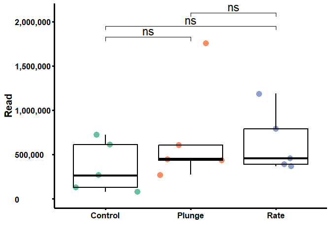
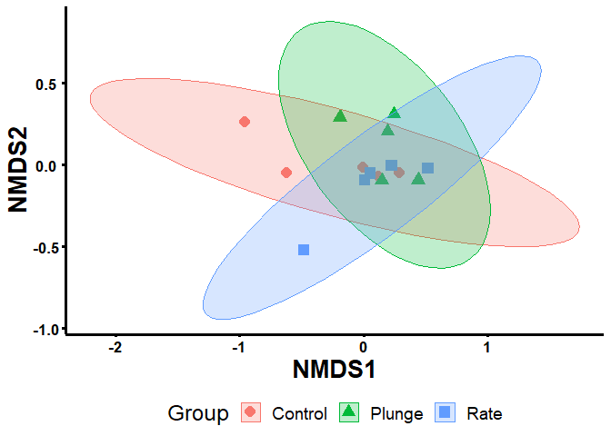
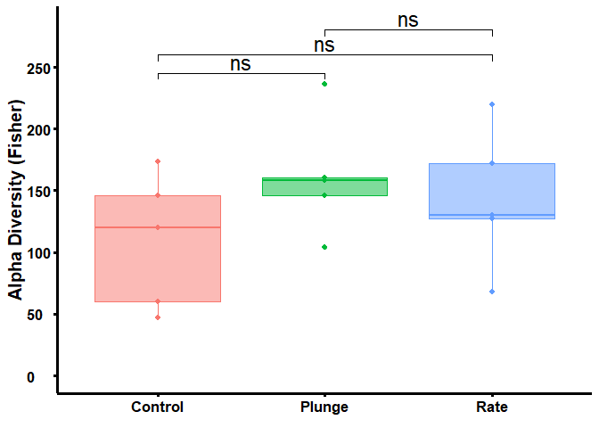
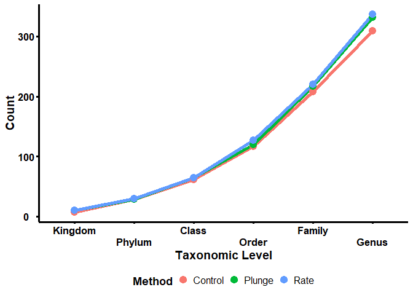
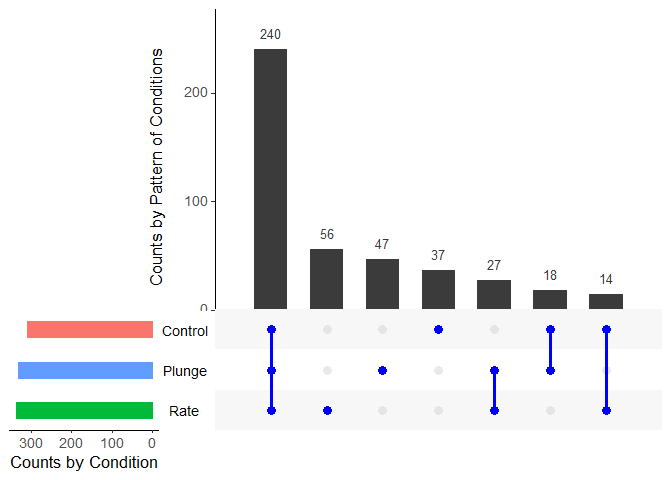
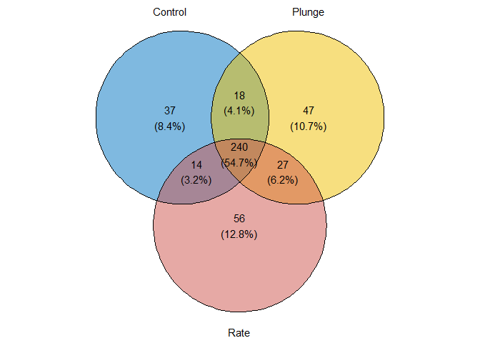
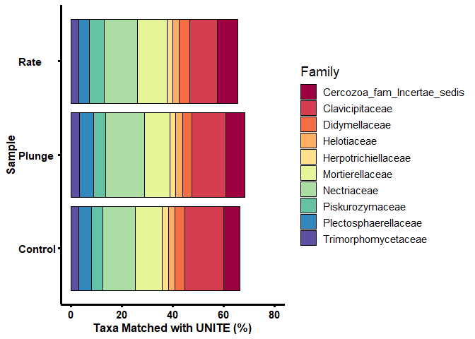
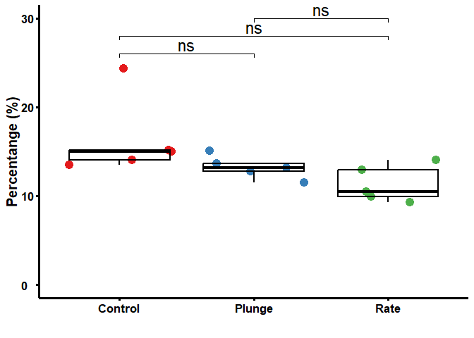
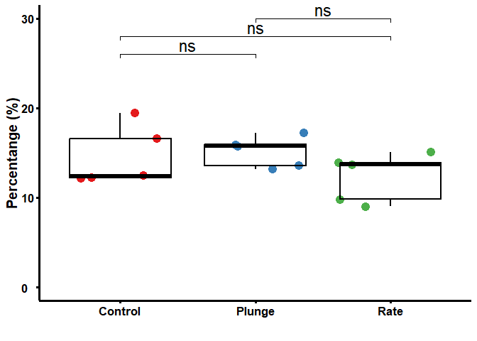

## Cyropreserve - ITS data

Soil microbiomes are responsive to seasonal and long-term environmental
factors, impacting their composition and function. This manuscript
explores cryopreservation techniques using a controlled rate cooler and
assesses the genomic integrity and bacterial growth of an exemplar soil
sample before and after cryopreservation. The study demonstrates that
the controlled rate cooler effectively preserves the DNA content of the
microbiome. Two cryopreservation methods were compared with control
samples, and the results indicate successful cryopreservation using
metabarcoding. Enrichment with liquid medium showed similar responses
between cryopreserved and non-cryopreserved soil samples, supporting the
efficacy of cryopreservation. This study represents the first report of
cryopreservation of soil using a Stirling cycle cooling approach,
highlighting its potential for future microbiome research.

### Load the required packages

    # install.packages(c("ggplot2", "ggpubr", "dplyr", 
    #                   "rstatix", "purrr", "reshape2",
    #                   "UpSetR","plyr", "dplyr", "RColorBrewer"))
    library("ggplot2")
    library("ggpubr")
    library("dplyr")
    library("rstatix")
    library("purrr")
    library("reshape2")
    library("UpSetR")
    library("plyr")
    library("dplyr")
    library("RColorBrewer")

    # if (!require("BiocManager", quietly = TRUE))
    #     install.packages("BiocManager")
    # BiocManager::install(c("phyloseq", "DESeq2", "microbiome"))
    library("phyloseq")
    library("DESeq2")
    library("microbiome")

    # if(!requireNamespace("devtools", quietly = TRUE)){install.packages("devtools")}
    # devtools::install_github("jbisanz/qiime2R") # current version is 0.99.20
    library("qiime2R")

    # devtools::install_github("pmartinezarbizu/pairwiseAdonis/pairwiseAdonis")
    library("pairwiseAdonis")

    # if (!require(devtools)) install.packages("devtools")
    # devtools::install_github("yanlinlin82/ggvenn")
    library("ggvenn")

### Qiime2 to Phyloseq

To work with QIIME2 outcomes in the R environment, it is beneficial to
convert the data into the phyloseq object structure. This process
involves importing and transforming the feature table and sample
metadata, allowing for comprehensive analysis and visualization of
microbial community profiles. The phyloseq package in R provides
functions to organize and manipulate the data within the phyloseq
object, enabling various analyses such as diversity assessments,
differential abundance testing, and taxonomic profile visualization. By
converting QIIME2 outcomes to phyloseq, researchers can leverage the
capabilities of R for advanced statistical analysis, integration with
other omics data, and gaining deeper insights into the microbiome
datasets.

    # Convert qiime2 to phyloseq format
    physeq <- qza_to_phyloseq(
      features = "qiime2/table-its-with-phyla-no-mitochondria-no-chloroplast.qza", # table.qza
      # tree = "inst/artifacts/2020.2_moving-pictures/rooted-tree.qza",
      taxonomy = "qiime2/taxonomy-its.qza",
      metadata = "meta-data-ITS.txt"
    )
    physeq ## confirm the object

    ## phyloseq-class experiment-level object
    ## otu_table()   OTU Table:         [ 4940 taxa and 15 samples ]
    ## sample_data() Sample Data:       [ 15 samples by 3 sample variables ]
    ## tax_table()   Taxonomy Table:    [ 4940 taxa by 7 taxonomic ranks ]

### import data and subgroup the data

Normalise number of reads in each sample by using median sequencing
depth

    ## Normalise number of reads in each sample by using median sequencing depth
    total = median(sample_sums(physeq))
    standf = function(x, t=total) round(t * (x / sum(x)))
    physeq.norm = transform_sample_counts(physeq, standf)

    physeq.norm.group = merge_samples(physeq.norm, "Group") # Sum between replicate samples
    sample_data(physeq.norm.group)$Group <- rownames(sample_data(physeq.norm.group))

    rm(total, standf)

    meta <- data.frame(physeq.norm@sam_data)

    # Now you can use 'meta_df' in your functions
    stat.test1 <- meta %>%
      t_test(Raw_Reads ~ Group) %>%
      adjust_pvalue(method = "bonferroni") %>%
      add_significance()

    print(stat.test1)

    ## # A tibble: 3 × 10
    ##   .y.       group1  group2    n1    n2 statistic    df     p p.adj p.adj.signif
    ##   <chr>     <chr>   <chr>  <int> <int>     <dbl> <dbl> <dbl> <dbl> <chr>       
    ## 1 Raw_Reads Control Plunge     5     5    -1.15   5.76 0.296 0.888 ns          
    ## 2 Raw_Reads Control Rate       5     5    -1.36   7.72 0.211 0.633 ns          
    ## 3 Raw_Reads Plunge  Rate       5     5     0.211  6.45 0.84  1     ns

    # Plot a graph of the abundance of Fusarium for each sample grouped by Group:
    Raw_Reads.Ori <- ggplot(subset(meta, Group %in% c("Control","Plunge","Rate")),
                            aes(x = Group, y = Raw_Reads, colour = interaction(Group))) +
      geom_point(alpha = 1, position = "jitter", size = 4) +
      geom_boxplot(alpha = 0, colour = "black", size = 0.8) +
      scale_y_continuous(labels = scales::comma, limits=c(0, 2100000), 
                         breaks = c(0, 500000, 1000000, 1500000, 2000000)) + 
        stat_pvalue_manual(stat.test1, 
                         y.position = c(1825000, 1950000, 2100000),
                         label = "p.adj.signif",
                         face="bold", 
                         size = 6, 
                         linetype = 1,
                         tip.length = 0.02,
                         inherit.aes = FALSE) + 
      theme_classic() + 
      labs(x = "", y = "Read") +
      theme(text = element_text(size=18, colour = "black"), 
            axis.ticks = element_line(colour = "black", size = 1.25),
            axis.line = element_line(colour = 'black', size = 1.25),
            axis.text.x = element_text(colour = "black",
                                       angle=0, 
                                       size = 13, face="bold"),
            axis.text.y = element_text(angle=0, hjust=0, colour = "black",
                                       size = 13, face="bold"),
            axis.title.y = element_text(color="black", size=15,face="bold"),
            legend.position = "none") +
      scale_color_brewer(palette="Set2")+
      scale_fill_brewer(palette="Set2")

    # pdf(file = "Raw_Reads.ITS.pdf", width = 6, height = 5)
    Raw_Reads.Ori

    # Close the PDF device and save the plot to a file
    # dev.off()

    # Clean up by removing objects that are no longer needed
    rm(physeq.ori, meta, Raw_Reads.Ori, stat.test1)

### Beta diversity

Beta diversity is a measure used in ecological and microbial community
studies to assess the dissimilarity of species or taxa compositions
between different samples. It quantifies the variation in community
structure and helps researchers understand the diversity and uniqueness
of microbial communities. Various metrics, such as Bray-Curtis
dissimilarity and Jaccard index, are employed to calculate beta
diversity values, which can be visualized using techniques like
Principal Coordinate Analysis or Non-Metric Multidimensional Scaling.
Beta diversity analysis allows for comparisons of microbial communities
across habitats, treatments, or environmental gradients, revealing
factors influencing community variation and identifying key drivers of
community structure. It provides insights into the functional and
ecological significance of different microbial assemblages and their
responses to environmental changes, aiding our understanding of
microbial community dynamics and their roles in ecology, environmental
science, and human health research.

    nmds <- ordinate(physeq = physeq.norm, method = "NMDS", distance = "bray")

    ## Square root transformation
    ## Wisconsin double standardization
    ## Run 0 stress 0.04658859 
    ## Run 1 stress 0.07813351 
    ## Run 2 stress 0.0465886 
    ## ... Procrustes: rmse 2.540854e-05  max resid 6.940707e-05 
    ## ... Similar to previous best
    ## Run 3 stress 0.08505863 
    ## Run 4 stress 0.1027284 
    ## Run 5 stress 0.04658865 
    ## ... Procrustes: rmse 8.103454e-05  max resid 0.0002235398 
    ## ... Similar to previous best
    ## Run 6 stress 0.04658859 
    ## ... New best solution
    ## ... Procrustes: rmse 1.709803e-05  max resid 4.546607e-05 
    ## ... Similar to previous best
    ## Run 7 stress 0.06610809 
    ## Run 8 stress 0.06715055 
    ## Run 9 stress 0.04710306 
    ## Run 10 stress 0.0465886 
    ## ... Procrustes: rmse 4.43267e-05  max resid 0.000123154 
    ## ... Similar to previous best
    ## Run 11 stress 0.06610781 
    ## Run 12 stress 0.1027287 
    ## Run 13 stress 0.04658859 
    ## ... Procrustes: rmse 7.64542e-06  max resid 2.112694e-05 
    ## ... Similar to previous best
    ## Run 14 stress 0.04658863 
    ## ... Procrustes: rmse 5.928742e-05  max resid 0.0001659471 
    ## ... Similar to previous best
    ## Run 15 stress 0.1015242 
    ## Run 16 stress 0.04658859 
    ## ... New best solution
    ## ... Procrustes: rmse 6.89699e-06  max resid 1.809912e-05 
    ## ... Similar to previous best
    ## Run 17 stress 0.04658867 
    ## ... Procrustes: rmse 9.947031e-05  max resid 0.0002805612 
    ## ... Similar to previous best
    ## Run 18 stress 0.0465886 
    ## ... Procrustes: rmse 3.204326e-05  max resid 9.014473e-05 
    ## ... Similar to previous best
    ## Run 19 stress 0.1027284 
    ## Run 20 stress 0.07827763 
    ## *** Best solution repeated 3 times

    Beta.its <- plot_ordination(
      physeq = physeq.norm,
      ordination = nmds,
      # title = "NMDS",
      color = "Group",
      shape = "Group") +
        # geom_text(aes(label = paste("Stress"), round(nmds$stress, 2)), 
        #         x = -0.9, y = -0.9, hjust = -0.9, vjust = -0.9) +
      # scale_x_discrete(name ="NMDS1 ()") + 
      # scale_y_discrete(name ="NMDS2 ()") + 
      theme_classic() + 
      geom_point(aes(color = Group), alpha = 1, size = 4) +
      theme(text = element_text(size=18, colour = "black"), 
            axis.ticks = element_line(colour = "black", size = 1.1),
            axis.line = element_line(colour = 'black', size = 1.1),
            axis.text.x = element_text(colour = "black", angle=0, 
                                       hjust=0.5, size = 13, face="bold"),
            axis.text.y = element_text(colour = "black", angle=0, 
                                       hjust=0.5, size = 13, face="bold"),
            axis.title.y = element_text(color="black", size=20,face="bold"), 
            axis.title.x = element_text(color="black", size=20,face="bold"),
                    legend.position = "bottom") + # This line moves the legend to the bottom
      stat_ellipse(geom = "polygon", type="norm", alpha=0.25, aes(fill = Group)) 

    # pdf(file = "Beta.its.pdf", width = 6,height = 6.1)
    Beta.its

    # Close the PDF device and save the plot to a file
    # dev.off()

    # rm(nmds, Beta.its)

### Alpha diversity

Alpha diversity is a fundamental concept in ecology and refers to the
diversity or richness of species within a specific community or habitat.
In the context of microbial ecology, alpha diversity represents the
diversity of microorganisms within a given sample or microbiome. It
provides insights into the variety and evenness of microbial species
present in a particular environment. Common measures of alpha diversity
include species richness, which counts the number of unique species, and
evenness, which assesses the distribution of species abundances. Alpha
diversity is crucial for understanding the stability, resilience, and
functional potential of microbial communities. It can be influenced by
various factors, including environmental conditions, host factors, and
perturbations. By comparing alpha diversity across different samples or
experimental groups, researchers can gain insights into the impact of
factors such as disease, habitat changes, or interventions on microbial
community structure.

    # available measurements [c("Observed", "Chao1", "ACE", "Shannon", "Simpson", "InvSimpson", "Fisher")]
    tab = cbind(x = sample_data(physeq.norm), 
                y = estimate_richness(physeq.norm, measures = 'Fisher'))

    stat.test <- tab %>%
      # group_by(Neutrophils, GROUP1) %>%
      t_test(Fisher ~ x.Group) %>%
      adjust_pvalue(method = "bonferroni") %>%
      add_significance()

    alpha.its <- ggplot(data = tab, aes(x = x.Group, y = Fisher, color = x.Group, fill = x.Group)) + 
      theme_classic() + 
      labs(# title = "IBD Patients", 
        x = element_blank(), 
        y = "Alpha Diversity (Fisher)") + 
      geom_point(size = 1.75) + 
      geom_boxplot(alpha = 0.5) + 
      stat_pvalue_manual(stat.test, 
                         y.position = c(245, 260, 280),
                         label = "p.adj.signif",
                         face="bold", 
                         size = 6, 
                         linetype = 1,
                         tip.length = 0.02,
                         inherit.aes = FALSE) + 
      scale_y_continuous(limits=c(0 , 285), breaks = c(0, 50, 100, 150, 200, 250)) +
      theme(text = element_text(size=18, colour = "black"), 
            axis.ticks = element_line(colour = "black", size = 1.1),
            axis.line = element_line(colour = 'black', size = 1.1),
            axis.text.x = element_text(colour = "black",
                                       angle=0, 
                                       size = 13, face="bold"),
            axis.text.y = element_text(angle=0, hjust=0, colour = "black",
                                       size = 13, face="bold"),
            axis.title.y = element_text(color="black", size=15,face="bold"),
            legend.position = "none") 

    # pdf(file = "alpha.its.pdf", width = 6, height = 5)
    alpha.its

    # Close the PDF device and save the plot to a file
    # dev.off()

    rm(tab, stat.test, alpha.its)

#### Determine the count of taxa within each level and group

The purpose of this process is to visualise the distribution of the
number of matched abundance across different groups and to identify any
patterns in the distribution of the processed abundance within
individual group.

    # Create an empty list to store genus-level abundance data for each taxonomic level
    gentab_levels <- list()

    # Set observation threshold
    observationThreshold <- 15

    # Define the taxonomic levels
    genus_levels <- c("Kingdom", "Phylum", "Class", "Order", 
                      "Family", "Genus", "Species")

    # loop through all the taxonomic levels
    for (level in genus_levels) {
      
      # create a factor variable for each level
      genfac <- factor(tax_table(physeq.norm.group)[, level])
      
      # calculate the abundance of each genus within each sample
      gentab <- apply(otu_table(physeq.norm.group), MARGIN = 1, function(x) {
        tapply(x, INDEX = genfac, FUN = sum, na.rm = TRUE, simplify = TRUE)
      })
      
      # calculate the number of samples in which each genus is observed above the threshold
      level_counts <- apply(gentab > observationThreshold, 2, sum)
      
      # create a data frame of level counts with genus names as row names
      BB <- as.data.frame(level_counts)
      BB$name <- row.names(BB)
      
      # add the data frame to the gentab_levels list
      gentab_levels[[level]] <- BB
    }

    # Combine all level counts data frames into one data frame
    B2 <- gentab_levels %>% purrr::reduce(dplyr::full_join, by = "name")

    # Set row names and column names
    rownames(B2) <- B2$name
    B2$name <- NULL
    colnames(B2)[1:7] <- genus_levels
    B2$Species <- NULL
    B2$name <- rownames(B2)

    # Print the resulting data frame
    print(B2)

    ##         Kingdom Phylum Class Order Family Genus    name
    ## Control       7     28    61   116    208   309 Control
    ## Plunge       10     28    64   120    217   332  Plunge
    ## Rate         10     29    64   127    220   337    Rate

    data_long <- melt(B2, id.vars = "name", 
                      variable.name = "Dataset", 
                      value.name = "Count")
    colnames(data_long) = c("Method","Taxonomic.Level","Count")

    tax.its <- ggplot(data_long, aes(x = Taxonomic.Level, 
                                     y = Count, 
                                     color = Method, 
                                     group = Method)) +
      geom_line(size = 2) + 
      geom_point(size = 4) +
      labs(x = "Taxonomic Level", y = "Count", color = "Method") +
      theme_classic() + 
      theme(
        text = element_text(size = 19, colour = "black"), 
        axis.ticks = element_line(colour = "black", size = 1.1),
        axis.line = element_line(colour = 'black', size = 1.1),
        axis.text.x = element_text(colour = "black", angle = 0, hjust = 0.5, size = 13, face = "bold"),
        axis.text.y = element_text(colour = "black", angle = 0, hjust = 0.5, size = 13, face = "bold"),
        axis.title.y = element_text(color = "black", size = 14, face = "bold"), 
        axis.title.x = element_text(color = "black", size = 14, face = "bold"),
        legend.title = element_text(size = 13.5, face = "bold"),
        legend.text = element_text(size = 12),
        legend.key.size=unit(0.4,"cm"),
        legend.position = "bottom") + # This line moves the legend to the bottom
      scale_x_discrete(guide = guide_axis(n.dodge=2)) +
      scale_y_continuous(breaks=seq(0,600,by=100))

    # pdf(file = "tax.its.pdf", width = 6, height = 6.1)
    tax.its

    # Close the PDF device and save the plot to a file
    # dev.off()

    # Clean up by removing unnecessary objects
    # rm(gentab_levels, genus_levels, observationThreshold, 
    #    BB, B2, data_long, gentab, tax.its, genfac, level, level_counts)

### Upset plot using UpsetR

To investigate the common taxa and unique taxa, we chose the taxa at the
genus level for comparison with three different groups in order to find
the common core recovered taxa from our experiment. We visualised this
using UpSetR plots and Venn diagrams.

#### Uncultivated experiment - Upset plot

    # Aggregate taxa at the genus level
    B <- aggregate_taxa(physeq.norm.group, "Genus", verbose = TRUE)

    ## [1] "Remove taxonomic information below the target level"
    ## [1] "Mark the potentially ambiguous taxa"
    ## [1] "-- split"
    ## [1] "-- sum"
    ## [1] "Create phyloseq object"
    ## [1] "Remove ambiguous levels"
    ## [1] "-- unique"
    ## [1] "-- Rename the lowest level"
    ## [1] "-- rownames"
    ## [1] "-- taxa"
    ## [1] "Convert to taxonomy table"
    ## [1] "Combine OTU and Taxon matrix into Phyloseq object"
    ## [1] "Add the metadata as is"

    # Remove undesired genera
    # B2 <- subset_taxa(B, !get("Genus") %in% c("uncultured", "Unknown"))

    # Remove unwanted taxon names
    taxa_to_remove <- c("uncultured", "Unknown")
    B2 <- subset_taxa(B, !get("Genus") %in% taxa_to_remove)

    # Extract relevant data from the phyloseq object
    sample_data <- sample_data(B2)
    otu_table <- otu_table(B2)
    abundance <- as.vector(otu_table)

    # Create a tibble with the extracted data
    D <- tibble(
      Sample = rep(sample_data$Group, each = nrow(otu_table)),
      ASV = rep(rownames(otu_table), times = ncol(otu_table)),
      Abundance = abundance
    ) %>%
      group_by(Sample) %>%
      mutate(rank = rank(plyr::desc(Abundance))) %>%
       filter(Abundance > 15) %>%
      ungroup() %>%
      select(Sample, Abundance, ASV)

    # Remove the Abundance column
    D$Abundance <- NULL

    # Rename the second column to "ASV"
    names(D)[2] <- "ASV"
    names(D)[1] <- "Direct"

    # Convert data from long to wide format
    E <- dcast(D, ASV ~ Direct)

    # Define a binary function
    binary_fun <- function(x) {
      x[is.na(x)] <- 0
      ifelse(x > 0, 1, 0)
    }

    col = c("#00BA38","#619CFF","#F8766D")

    # Apply the binary function to columns 2 to 4
    temp_df <- apply(E[2:4], 2, binary_fun)
    temp_df <- as.data.frame(temp_df)

    # Create an UpSet plot
    upset_plot <- upset(temp_df, 
                        sets = colnames(temp_df), 
                        sets.bar.color = (col),
                        order.by = "freq", 
                        empty.intersections = "on",
                        mainbar.y.label = "Counts by Pattern of Conditions", 
                        sets.x.label = "Counts by Condition",
                        matrix.color="blue", 
                        mb.ratio = c(0.65, 0.35),
                        point.size= 2.75,
                        line.size = 1.25, 
                        text.scale = 1.5
    )

    # Open a new PDF graphics device
    # pdf(file = "UpSet_ITS.pdf", width=6.5,height=4.5)

    # Print the UpSet plot
    print(upset_plot)

    # Close the PDF device and save the plot to a file
    # dev.off()  

#### Uncultivated experiment - Vann diagram

    # Extract the rows where the value is 1 for each column
    Cont <- rownames(temp_df)[temp_df$Control == 1]
    Plun <- rownames(temp_df)[temp_df$Plunge == 1]
    Rate <- rownames(temp_df)[temp_df$Rate == 1]

    # Create a list with the extracted data
    list_data <- list("Control" = Cont, "Plunge" = Plun, "Rate" = Rate)

    # Use ggvenn to create the Venn diagram
    Venn <- ggvenn(
      list_data, 
      fill_color = c("#0073C2FF", "#EFC000FF", "#CD534CFF"),
      stroke_size = 0.5, set_name_size = 4
      )

    # Open a new PDF graphics device
    # pdf(file = "Fig08C_Venn.pdf", width=5,height=5)

    # Print the Venn plot
    print(Venn)

    # Close the PDF device and save the plot to a file
    # dev.off()

### Pairwise comparison using PERMANOVA

Pairwise PERMANOVA (Permutational Multivariate Analysis of Variance) is
a statistical method used in microbial community studies to examine
differences between groups or treatments. It assesses the dissimilarity
between samples, allowing for the comparison of multivariate data. This
approach is useful to focus on specific group comparisons rather than
comparing all groups simultaneously. It enables the investigation of the
effects of specific treatments on microbial communities, helping to
determine if there are significant differences in community composition
between selected groups. By considering variation within and between
groups, pairwise PERMANOVA offers a robust statistical assessment of
dissimilarity, providing insights into community structure differences.

    metdat = as.data.frame(as.matrix(physeq.norm@sam_data))
    dat = as.data.frame(t(as.data.frame(physeq.norm@otu_table)))
    pairwise.adonis(dat, metdat$Group, sim.function = "vegdist",
                    sim.method = "bray", p.adjust.m = "bonferroni",
                    reduce = NULL, perm = 100000)

    ##               pairs Df  SumsOfSqs  F.Model        R2    p.value p.adjusted sig
    ## 1 Control vs Plunge  1 0.05745805 1.125904 0.1233746 0.23321767  0.6996530    
    ## 2   Control vs Rate  1 0.07640305 1.380438 0.1471614 0.03997960  0.1199388    
    ## 3    Plunge vs Rate  1 0.08478784 1.653684 0.1713008 0.05470945  0.1641284

    rm(metdat, dat)

### Top 10 at family level

We begin our analysis by identifying the top 10 taxa at the family
level, along with their corresponding percentages. This gives us a
snapshot of the microbial community’s composition. To visualise this
data, we first create a bar plot that displays the accumulated
percentages of these top 10 taxa. Following this, we calculate the
statistics in percentage form for these taxa at the family level.

#### Uncultivated Experiment - Bar Plot

    # Merge reads by groups
    AyBCode <- merge_samples(physeq, "Group", fun = sum)

    ## Normalised number of reads in percentage
    standf = function(x) x / sum(x) * 100
    AyBCode.percent = transform_sample_counts(AyBCode, standf)

    ##### unwanted taxon names
    taxa_to_remove <- c("uncultured", "Unknown")
    # Remove unwanted taxon names
    AyBCode.percent.B <- subset_taxa(AyBCode.percent, !get("Family") %in% taxa_to_remove)
    ## Aggregate
    AyBCode.percent.B <- aggregate_taxa(AyBCode.percent.B, "Family", verbose = TRUE)

    ## [1] "Remove taxonomic information below the target level"
    ## [1] "Mark the potentially ambiguous taxa"
    ## [1] "-- split"
    ## [1] "-- sum"
    ## [1] "Create phyloseq object"
    ## [1] "Remove ambiguous levels"
    ## [1] "-- unique"
    ## [1] "-- Rename the lowest level"
    ## [1] "-- rownames"
    ## [1] "-- taxa"
    ## [1] "Convert to taxonomy table"
    ## [1] "Combine OTU and Taxon matrix into Phyloseq object"
    ## [1] "Add the metadata as is"

    top10otus = names(sort(taxa_sums(AyBCode.percent.B), TRUE)[1:10])
    taxtab10 = cbind(tax_table(AyBCode.percent.B), Family = NA)
    taxtab10[top10otus, "Family"] <- as(tax_table(AyBCode.percent.B)[top10otus, "Family"],"character")
    tax_table(AyBCode.percent.B) <- tax_table(taxtab10)

    top10plot = prune_taxa(top10otus, AyBCode.percent.B)
    print(top10plot@otu_table)

    ## OTU Table:          [10 taxa and 3 samples]
    ##                      taxa are rows
    ##                               Control    Plunge      Rate
    ## Didymellaceae                3.892923  3.704637  4.326121
    ## Herpotrichiellaceae          2.413237  2.236401  2.113900
    ## Helotiaceae                  2.622411  2.642670  2.444422
    ## Plectosphaerellaceae         5.027540  5.453886  4.105144
    ## Clavicipitaceae             15.154996 13.293230 10.731729
    ## Nectriaceae                 12.975410 15.262021 13.099461
    ## Piskurozymaceae              4.507682  4.787017  5.848620
    ## Trimorphomycetaceae          2.803656  3.216637  2.959132
    ## Mortierellaceae             10.498054 10.096468 11.804246
    ## Cercozoa_fam_Incertae_sedis  6.293547  7.596847  7.951049

    # Calculate the sum of each column
    col_sums <- colSums(as.data.frame(top10plot@otu_table))

    # Add a new row with the sums
    top10plot.df <- rbind('SUM' = col_sums, as.data.frame(top10plot@otu_table))

    # Print the dataframe
    print(top10plot.df)

    ##                               Control    Plunge      Rate
    ## SUM                         66.189455 68.289814 65.383824
    ## Didymellaceae                3.892923  3.704637  4.326121
    ## Herpotrichiellaceae          2.413237  2.236401  2.113900
    ## Helotiaceae                  2.622411  2.642670  2.444422
    ## Plectosphaerellaceae         5.027540  5.453886  4.105144
    ## Clavicipitaceae             15.154996 13.293230 10.731729
    ## Nectriaceae                 12.975410 15.262021 13.099461
    ## Piskurozymaceae              4.507682  4.787017  5.848620
    ## Trimorphomycetaceae          2.803656  3.216637  2.959132
    ## Mortierellaceae             10.498054 10.096468 11.804246
    ## Cercozoa_fam_Incertae_sedis  6.293547  7.596847  7.951049

    top10.its <- plot_bar(top10plot, fill = "Family") + coord_flip() + 
      ylab("Taxa Matched with UNITE (%)") + ylim(0, 80) + 
      theme_classic() + 
      theme(text = element_text(size=14, colour = "black"), 
            axis.ticks = element_line(colour = "black", size = 1.1),
            axis.line = element_line(colour = 'black', size = 1.1),
            axis.text.x = element_text(colour = "black", angle=0, size = 11, face="bold"),
            axis.text.y = element_text(angle=0, hjust=0, colour = "black", size = 11, face="bold"),
            axis.title.y = element_text(color="black", size=12,face="bold"),
            axis.title.x = element_text(color="black", size=12,face="bold"),
            legend.position = "right") +
      scale_color_brewer(palette="Spectral")+
      scale_fill_brewer(palette="Spectral")

    # pdf(file = "top10.its.pdf", width = 6.75, height = 5)
    top10.its

    # Close the PDF device and save the plot to a file
    # dev.off()

    # rm(physeq.ori, physeq.rich, AyBCode, 
    #    standf, AyBCode.percent, top10otus, 
    #    taxtab10, top10plot, top10.ori, top10.rich)

#### Uncultivated treatment - Calculate the statistics in percentange on the top 10 family level

    ## Normalised number of reads in percentage
    AyBCode.percent = transform_sample_counts(physeq.norm, standf)

    # Subset the phyloseq object for the top 10 OTUs
    physeq.top10 <- subset_taxa(AyBCode.percent, Family %in% top10otus)

    # Aggregate taxa at the genus level
    physeq.top10 <- aggregate_taxa(physeq.top10, "Family", verbose = TRUE)

    ## [1] "Remove taxonomic information below the target level"
    ## [1] "Mark the potentially ambiguous taxa"
    ## [1] "-- split"
    ## [1] "-- sum"
    ## [1] "Create phyloseq object"
    ## [1] "Remove ambiguous levels"
    ## [1] "-- unique"
    ## [1] "-- Rename the lowest level"
    ## [1] "-- rownames"
    ## [1] "-- taxa"
    ## [1] "Convert to taxonomy table"
    ## [1] "Combine OTU and Taxon matrix into Phyloseq object"
    ## [1] "Add the metadata as is"

    # Calculate the total abundance of Fusarium for each sample
    meta = AyBCode.percent@sam_data
    otudf = as.data.frame(t(as.data.frame(physeq.top10@otu_table)))

    # Assuming 'meta' and 'otudf' are your data frames
    combined_df <- merge(meta, otudf, by = "row.names", all = TRUE)

    # Set row names of the combined data frame
    rownames(combined_df) <- combined_df$Row.names

    # Remove the 'Row.names' column
    combined_df$Row.names <- NULL

    # Get the column names from "Bryobacteraceae" onwards
    cols <- colnames(combined_df)[which(colnames(combined_df) == "Didymellaceae"):ncol(combined_df)]

    # Initialize an empty data frame to store the test results
    stat.test_df <- data.frame()

    # Loop over the columns
    for(i in seq_along(cols)){
      # Perform the t-test for each column
      stats <- combined_df %>%
        t_test(reformulate("Group", response=cols[i])) %>%
        adjust_pvalue(method = "bonferroni") %>%
        add_significance()
      
      # Add a new column to record the run number
      stats$Run <- i
      
      # Bind the results to the data frame
      stat.test_df <- rbind(stat.test_df, stats)
    }

    # Print the data frame
    print(stat.test_df)

    ## # A tibble: 30 × 11
    ##    .y.        group1 group2    n1    n2 statistic    df     p p.adj p.adj.signif
    ##    <chr>      <chr>  <chr>  <int> <int>     <dbl> <dbl> <dbl> <dbl> <chr>       
    ##  1 Didymella… Contr… Plunge     5     5     1.19   7.44 0.27  0.81  ns          
    ##  2 Didymella… Contr… Rate       5     5    -0.392  5.43 0.71  1     ns          
    ##  3 Didymella… Plunge Rate       5     5    -2.21   6.34 0.067 0.201 ns          
    ##  4 Herpotric… Contr… Plunge     5     5     0.662  6.66 0.53  1     ns          
    ##  5 Herpotric… Contr… Rate       5     5     0.795  4.59 0.466 1     ns          
    ##  6 Herpotric… Plunge Rate       5     5     0.438  5.51 0.678 1     ns          
    ##  7 Helotiace… Contr… Plunge     5     5     0.372  7.92 0.72  1     ns          
    ##  8 Helotiace… Contr… Rate       5     5     0.530  7.58 0.611 1     ns          
    ##  9 Helotiace… Plunge Rate       5     5     0.180  7.85 0.862 1     ns          
    ## 10 Plectosph… Contr… Plunge     5     5    -0.798  5.99 0.455 1     ns          
    ## # ℹ 20 more rows
    ## # ℹ 1 more variable: Run <int>

    # Clean up by removing objects that are no longer needed
    # rm(physeq.top10, meta, otudf, combined_df, cols, col, stats, calc_stats, top10otus, stats_list)

### Plot the graph for Clavicipitaceae

    ## Normalised number of reads in percentage
    AyBCode.percent = transform_sample_counts(physeq.norm, standf)
    physeq.a.genus <- subset_taxa(AyBCode.percent, Family == "Clavicipitaceae")

    # Calculate the total abundance of Clavicipitaceae for each sample
    meta = data.frame(AyBCode.percent@sam_data)
    otudf = as.data.frame(t(as.data.frame(physeq.a.genus@otu_table)))
    meta$Clavicipitaceae = rowSums(otudf)

    stat.test1 <- meta %>%
      t_test(Clavicipitaceae ~ Group) %>%
      adjust_pvalue(method = "bonferroni") %>%
      add_significance()

    # Plot a graph of the abundance of Clavicipitaceae for each sample grouped by Group:
    Clavicipitaceae.Rich <- ggplot(subset(meta, Group %in% c("Control","Plunge","Rate")),
                                 aes(x = Group, y = Clavicipitaceae, colour = interaction(Group))) +
      geom_point(alpha = 1, position = "jitter", size = 4) +
      geom_boxplot(alpha = 0, colour = "black", size = 0.8)+
      theme_classic() + 
      labs(x = "", y = "Percentange (%)") +
      stat_pvalue_manual(stat.test1, 
                         y.position = c(26, 28, 30),
                         label = "p.adj.signif",
                         face="bold", 
                         size = 6, 
                         linetype = 1,
                         tip.length = 0.02,
                         inherit.aes = FALSE) + 
      scale_y_continuous(limits=c(0, 30), breaks = c(0, 10, 20, 30)) +
      theme(text = element_text(size=18, colour = "black"), 
            axis.ticks = element_line(colour = "black", size = 1.25),
            axis.line = element_line(colour = 'black', size = 1.25),
            axis.text.x = element_text(colour = "black",
                                       angle=0, 
                                       size = 13, face="bold"),
            axis.text.y = element_text(angle=0, hjust=0, colour = "black",
                                       size = 13, face="bold"),
            axis.title.y = element_text(color="black", size=15,face="bold"),
            legend.position = "none") +
      scale_color_brewer(palette="Set1")+
      scale_fill_brewer(palette="Set1")

    # pdf(file = "Clavicipitaceae.ITS.pdf", width = 6, height = 5)
    Clavicipitaceae.Rich

    # Close the PDF device and save the plot to a file
    # dev.off()

    # Clean up by removing objects that are no longer needed
    rm(physeq.a.genus, meta, otudf, AyBCode.percent)

### Plot the graph for Nectriaceae

    ## Normalised number of reads in percentage
    AyBCode.percent = transform_sample_counts(physeq.norm, standf)
    physeq.a.genus <- subset_taxa(AyBCode.percent, Family == "Nectriaceae")

    # Calculate the total abundance of Nectriaceae for each sample
    meta = data.frame(AyBCode.percent@sam_data)
    otudf = as.data.frame(t(as.data.frame(physeq.a.genus@otu_table)))
    meta$Nectriaceae = rowSums(otudf)

    stat.test1 <- meta %>%
      t_test(Nectriaceae ~ Group) %>%
      adjust_pvalue(method = "bonferroni") %>%
      add_significance()

    # Plot a graph of the abundance of Nectriaceae for each sample grouped by Group:
    Nectriaceae.Rich <- ggplot(subset(meta, Group %in% c("Control","Plunge","Rate")),
                                 aes(x = Group, y = Nectriaceae, colour = interaction(Group))) +
      geom_point(alpha = 1, position = "jitter", size = 4) +
      geom_boxplot(alpha = 0, colour = "black", size = 0.8)+
      theme_classic() + 
      labs(x = "", y = "Percentange (%)") +
      stat_pvalue_manual(stat.test1, 
                         y.position = c(26, 28, 30),
                         label = "p.adj.signif",
                         face="bold", 
                         size = 6, 
                         linetype = 1,
                         tip.length = 0.02,
                         inherit.aes = FALSE) + 
      scale_y_continuous(limits=c(0, 30), breaks = c(0, 10, 20, 30)) +
      theme(text = element_text(size=18, colour = "black"), 
            axis.ticks = element_line(colour = "black", size = 1.25),
            axis.line = element_line(colour = 'black', size = 1.25),
            axis.text.x = element_text(colour = "black",
                                       angle=0, 
                                       size = 13, face="bold"),
            axis.text.y = element_text(angle=0, hjust=0, colour = "black",
                                       size = 13, face="bold"),
            axis.title.y = element_text(color="black", size=15,face="bold"),
            legend.position = "none") +
      scale_color_brewer(palette="Set1")+
      scale_fill_brewer(palette="Set1")

    # pdf(file = "Nectriaceae.ITS.pdf", width = 6, height = 5)
    Nectriaceae.Rich

    # Close the PDF device and save the plot to a file
    # dev.off()

    # Clean up by removing objects that are no longer needed
    rm(physeq.a.genus, meta, otudf, AyBCode.percent)

    sessionInfo()

    ## R version 4.3.2 (2023-10-31 ucrt)
    ## Platform: x86_64-w64-mingw32/x64 (64-bit)
    ## Running under: Windows 11 x64 (build 22631)
    ## 
    ## Matrix products: default
    ## 
    ## 
    ## locale:
    ## [1] LC_COLLATE=English_United Kingdom.utf8 
    ## [2] LC_CTYPE=English_United Kingdom.utf8   
    ## [3] LC_MONETARY=English_United Kingdom.utf8
    ## [4] LC_NUMERIC=C                           
    ## [5] LC_TIME=English_United Kingdom.utf8    
    ## 
    ## time zone: Europe/London
    ## tzcode source: internal
    ## 
    ## attached base packages:
    ## [1] grid      stats4    stats     graphics  grDevices utils     datasets 
    ## [8] methods   base     
    ## 
    ## other attached packages:
    ##  [1] ggvenn_0.1.10               pairwiseAdonis_0.4.1       
    ##  [3] cluster_2.1.4               vegan_2.6-4                
    ##  [5] lattice_0.21-9              permute_0.9-7              
    ##  [7] qiime2R_0.99.6              microbiome_1.22.0          
    ##  [9] DESeq2_1.40.2               SummarizedExperiment_1.32.0
    ## [11] Biobase_2.62.0              MatrixGenerics_1.14.0      
    ## [13] matrixStats_1.2.0           GenomicRanges_1.54.1       
    ## [15] GenomeInfoDb_1.38.6         IRanges_2.36.0             
    ## [17] S4Vectors_0.40.2            BiocGenerics_0.48.1        
    ## [19] phyloseq_1.44.0             RColorBrewer_1.1-3         
    ## [21] plyr_1.8.9                  UpSetR_1.4.0               
    ## [23] reshape2_1.4.4              purrr_1.0.2                
    ## [25] rstatix_0.7.2               dplyr_1.1.4                
    ## [27] ggpubr_0.6.0                ggplot2_3.4.4              
    ## 
    ## loaded via a namespace (and not attached):
    ##  [1] bitops_1.0-7            gridExtra_2.3           rlang_1.1.1            
    ##  [4] magrittr_2.0.3          ade4_1.7-22             compiler_4.3.2         
    ##  [7] mgcv_1.9-0              vctrs_0.6.5             stringr_1.5.1          
    ## [10] pkgconfig_2.0.3         crayon_1.5.2            fastmap_1.1.1          
    ## [13] backports_1.4.1         XVector_0.42.0          labeling_0.4.3         
    ## [16] utf8_1.2.4              rmarkdown_2.25          xfun_0.40              
    ## [19] zlibbioc_1.48.0         jsonlite_1.8.8          biomformat_1.30.0      
    ## [22] highr_0.10              rhdf5filters_1.14.1     DelayedArray_0.28.0    
    ## [25] Rhdf5lib_1.24.2         BiocParallel_1.36.0     broom_1.0.5            
    ## [28] parallel_4.3.2          R6_2.5.1                stringi_1.8.3          
    ## [31] zCompositions_1.5.0-1   rpart_4.1.21            car_3.1-2              
    ## [34] Rcpp_1.0.12             iterators_1.0.14        knitr_1.45             
    ## [37] base64enc_0.1-3         nnet_7.3-19             Matrix_1.6-5           
    ## [40] splines_4.3.2           igraph_2.0.2            tidyselect_1.2.0       
    ## [43] rstudioapi_0.15.0       abind_1.4-5             yaml_2.3.7             
    ## [46] codetools_0.2-19        tibble_3.2.1            withr_3.0.0            
    ## [49] evaluate_0.23           Rtsne_0.17              foreign_0.8-85         
    ## [52] survival_3.5-7          Biostrings_2.70.2       pillar_1.9.0           
    ## [55] carData_3.0-5           DT_0.31                 checkmate_2.3.1        
    ## [58] foreach_1.5.2           NADA_1.6-1.1            generics_0.1.3         
    ## [61] RCurl_1.98-1.14         truncnorm_1.0-9         munsell_0.5.0          
    ## [64] scales_1.3.0            glue_1.7.0              Hmisc_5.1-1            
    ## [67] tools_4.3.2             data.table_1.15.0       locfit_1.5-9.8         
    ## [70] ggsignif_0.6.4          rhdf5_2.46.1            tidyr_1.3.1            
    ## [73] ape_5.7-1               colorspace_2.1-0        nlme_3.1-163           
    ## [76] GenomeInfoDbData_1.2.11 htmlTable_2.4.2         Formula_1.2-5          
    ## [79] cli_3.6.1               fansi_1.0.6             S4Arrays_1.2.0         
    ## [82] gtable_0.3.4            digest_0.6.33           SparseArray_1.2.4      
    ## [85] farver_2.1.1            htmlwidgets_1.6.4       htmltools_0.5.7        
    ## [88] multtest_2.56.0         lifecycle_1.0.4         MASS_7.3-60
