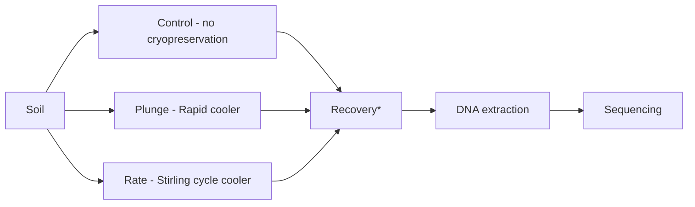

<<<<<<< HEAD
# Cryopreservation of a soil microbiome using a Stirling Cycle approach - A genomic assessment
=======
# Cryopreservation of a soil microbiome using a Stirling Cycle approach - a genomic assessment
>>>>>>> 7ee7cd697d59094d30614f8a3af7d0d68ac8393f

## Introduction
Various institutions store collections of soil samples in either a refrigerated or sometimes frozen state. However, these conditions are not optimised to maintain the integrity of the soil microbiome. In this study, we explore cryopreservation using a controlled rate cooler and assess the genomic content of a representative soil sample before and after cryopreservation. We applied and compared two cryopreservation methods with control soil aliquots. Optimising the cryopreservation of soil samples is crucial for advancing microbiome research, as it helps preserve stable and functionally intact microbiomes.

<<<<<<< HEAD
### The study workflow and the soil used for this project:

## Table of contents
#### 16S Sequencing data
00-[(TXT) - Metadata](https://github.com/paytonyau/Cryopreservation-Stirling-Cycle/blob/main/16s/16s-meta-data.txt)
=======
### The soil used for this project:

### The study workflow:

*The condition used for the recovery was 37°C for 5 minutes

>>>>>>> 7ee7cd697d59094d30614f8a3af7d0d68ac8393f

## Table of contents
### 16S Sequencing data

01-[(Markdown) Steps in proessing the 16s](https://github.com/paytonyau/Cryopreservation-Stirling-Cycle/blob/main/16s-DADA2.md)

02A-[(Rmarkdown) R data analysis](https://github.com/paytonyau/Cryopreservation-Stirling-Cycle/blob/main/16s/16s.Rmd)

02B-[(Rmarkdown - pdf) R data analysis](https://github.com/paytonyau/Cryopreservation-Stirling-Cycle/blob/main/16s/16s.pdf)

03-[(Document-zip) QC in multiqc file format](https://github.com/paytonyau/Cryopreservation-Stirling-Cycle/blob/main/16s/multiqc/multiqc.zip)

04-[(Document-qiime2) qiime2 outcomes](https://github.com/paytonyau/Cryopreservation-Stirling-Cycle/blob/main/16s/qiime2)

05-[(Document-figaro) qiime2 outcomes](https://github.com/paytonyau/Cryopreservation-Stirling-Cycle/blob/main/16s/figaro)

06-[(TXT) - Metadata](https://github.com/paytonyau/Cryopreservation-Stirling-Cycle/blob/main/16s/16s-meta-data.txt)

### ITS Sequencing data

01-[(Markdown) Steps in proessing the ITS](https://github.com/paytonyau/Cryopreservation-Stirling-Cycle/blob/main/ITS-UNITE.md)

02A-[(Rmarkdown) R data analysis](https://github.com/paytonyau/Cryopreservation-Stirling-Cycle/blob/main/ITS/ITS.Rmd)

02B-[(Rmarkdown - pdf) R data analysis](https://github.com/paytonyau/Cryopreservation-Stirling-Cycle/blob/main/ITS/ITS.pdf)

03-[(Document-zip) QC in multiqc file format](https://github.com/paytonyau/Cryopreservation-Stirling-Cycle/blob/main/ITS/multiqc/multiqc.zip)

04-[(Document-qiime2) qiime2 outcomes](https://github.com/paytonyau/Cryopreservation-Stirling-Cycle/blob/main/ITS/qiime2)

05-[(Document-figaro) qiime2 outcomes](https://github.com/paytonyau/Cryopreservation-Stirling-Cycle/blob/main/ITS/figaro)

06-[(TXT) - Metadata](https://github.com/paytonyau/Cryopreservation-Stirling-Cycle/blob/main/ITS/meta-data-ITS.txt)
###  Information
The preprint is available at [agrixiv](https://agrirxiv.org/search-details/?pan=20210277652)

Raw sequencing data deposited on the NCBI Sequence Read Archive (SRA) under the  ID [PRJEB46478](https://www.ncbi.nlm.nih.gov/bioproject/PRJEB46478/)

